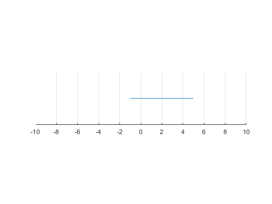

## Interval Notations and Examples

```{r global_options, include = FALSE}
try(source('../.Rprofile'))
```

`r text_shared_preamble_one`
`r text_shared_preamble_two`
`r text_shared_preamble_thr`

When we look at the problem facing a household, we often have to
restrict the choice set for example to an interval.

### Closed Interval

For example, if $x$ is hours working, perhaps the household has to work
at least $a$ hours and up to $b$ hours, so his choice is between $a$ and
$b$ hours inclusive.

The interval that is inclusive of both endpoints is called a closed
interval (note the square brackets):

-   **closed interval**:
    $\left\lbrack a,b\right\rbrack \equiv \lbrace x\in {R}:a\le x\le b\rbrace$

### Open Interval

In general, an open interval is defined as (Note here we use
parenthesis, not square brackest) :

-   **open
    interval**:$\left(a,b\right)\equiv \lbrace x\in {R}:a<x<b\rbrace$

### Half Open and Half Close Interval

We can also hafl half open intervals:

-   **half open (half closed) interval**:
    $\left\lbrack a,b\right)\equiv \lbrace x\in {R}:a\le x<b\rbrace$

-   **half open (half closed) interval**:
    $\left(a,b\right\rbrack \equiv \lbrace x\in {R}:a<x\le b\rbrace$

### Graph

If you were to graph an interval, you can draw an empty circle at either
end of an interval that is open, and a solid circle if it is closed at
that end.

    close all;
    figure();
    x = linspace(-1,5);
    line(x,0*ones(size(x)))
    set(gca,'ytick',[],'Ycolor','w','box','off')
    ylim([-0.1 0.1])
    xlim([-10  10])
    pbaspect([4 1 1])
    grid on

{width=500px}

\vspace{1em}
