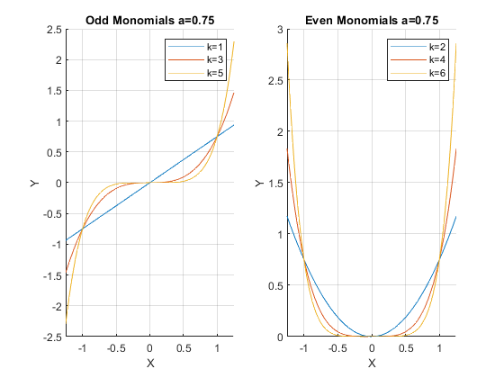
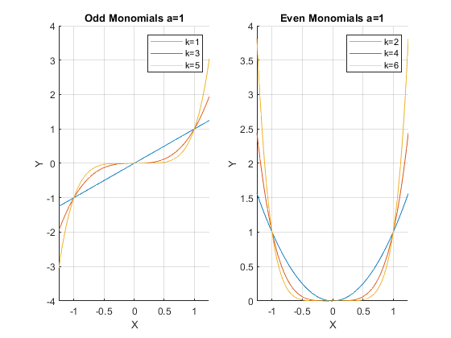
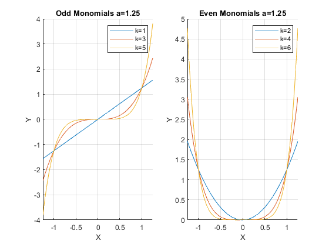

## Monomial and Polynomial

```{r global_options, include = FALSE}
try(source('../.Rprofile'))
```

`r text_shared_preamble_one`
`r text_shared_preamble_two`
`r text_shared_preamble_thr`

### Monomial

Functions of the form:

$$a\cdot x^k$$

are monomials.

-   $a$ is any real number, it is the coefficient.

-   $k$ is a positive integer, it is the degree of the monomial

### Polynomial

Monomials added up together are polynomials

$$a+b\cdot x+c\cdot x^2 +d\cdot x^3 +e\cdot x^4$$

The coefficients $a,b,c,d,e$ above could be positive or negative.

-   **Degree of Polynomial**: We say that this polynomial has degree
    of 4. You find the largest degree monomial in the polynomial, and
    its degree is the degree of the whole polynomial.

### Graphical Monomial Examples

Take a look at the function below, matlab makes it very easy to plot
functions. You can see that when we shift the coefficient for the
monomial, it rescales the function but does not change the ordinality.

Monomial when a = 0.75, a = 1, and a = 1.25:

    clear all;
    a = 0.75;
    monomial_graph(a)

{width=500px}

    a = 1;
    monomial_graph(a)

{width=500px}

    a = 1.25;
    monomial_graph(a)

{width=500px}

### Mononomials Function

When we program, we can write functions, which have parameters

    function monomial_graph(a)

    % Define a symbolic monomial
    syms x k
    f(x, k) = a*x^k;

    % Graph equation
    close all;
    figure();

    %Subplot 1
    subplot(1,2,1)
    % Create minimum x and maximum x point where to draw the graph
    x_lower_bd = -1.25;
    x_upper_bd = +1.25;
    % keep all figures, do not drop previous
    hold on;
    % Draw the function
    ak1 = fplot(@(x) f(x, 1), [x_lower_bd, x_upper_bd]);
    ak3 = fplot(@(x) f(x, 3), [x_lower_bd, x_upper_bd]);
    ak5 = fplot(@(x) f(x, 5), [x_lower_bd, x_upper_bd]);
    % Label
    xlabel('X');
    ylabel('Y');
    xlim([x_lower_bd, x_upper_bd])
    title(['Odd Monomials a=',num2str(a)])
    legend('k=1','k=3', 'k=5');
    grid on

    % Subplot 2
    subplot(1,2,2)
    % Create minimum x and maximum x point where to draw the graph
    x_lower_bd = -1.25;
    x_upper_bd = +1.25;
    % keep all figures, do not drop previous
    hold on;
    % Draw the function
    ak2 = fplot(@(x) f(x, 2), [x_lower_bd, x_upper_bd]);
    ak4 = fplot(@(x) f(x, 4), [x_lower_bd, x_upper_bd]);
    ak6 = fplot(@(x) f(x, 6), [x_lower_bd, x_upper_bd]);
    % Label
    xlabel('X');
    ylabel('Y');
    xlim([x_lower_bd, x_upper_bd])
    title(['Even Monomials a=', num2str(a)])
    legend('k=2','k=4', 'k=6');
    grid on
    end
