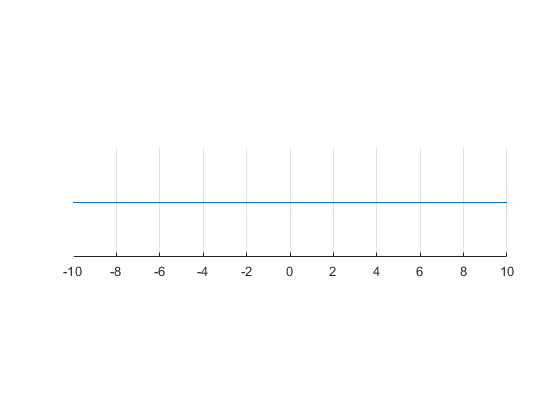
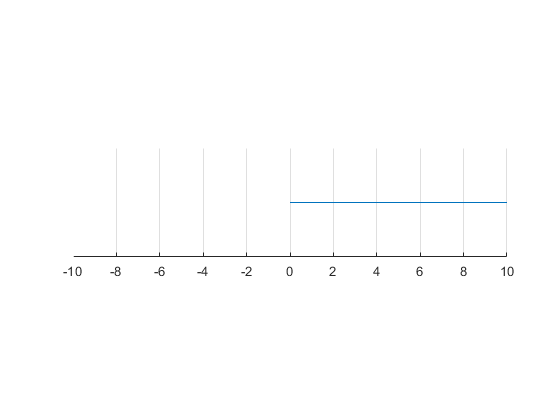

## Real Number and intervals

```{r global_options, include = FALSE}
try(source('../.Rprofile'))
```

`r text_shared_preamble_one`
`r text_shared_preamble_two`
`r text_shared_preamble_thr`

### Real Number Line

${{R^1 }}$ : can write $R^1$ or $R$ (you can add a superscript 1 to
emphasize this is first Euclidean space, either notation is fine), is
the real number line.

    close all;
    figure();
    x = linspace(-10,10);
    line(x,0*ones(size(x)))
    set(gca,'ytick',[],'Ycolor','w','box','off')
    ylim([-0.1 0.1])
    pbaspect([4 1 1])
    grid on

{width=500px}

### Non-negative numbers

In many economic problems, we have to restrict ourselves to numbers
greater or equal to zero.

-   We can not consume from negative numbers of apples

-   We can not produce with negative labor and capital

-   We would be infinitely unhappy (die) if there is zero consumption in
    a year

We can use the following notation to define the set of non-negative real
numbers:

${{R_{\ge 0} }}\equiv \lbrace x\in {R}:x\ge 0\rbrace$, some authors use
${{R_+ }}$ instead of ${{R_{\ge 0} }}$

And use inequality sign to define the set of real numbers greater than
zero:

${{R_{>0} }}\equiv \lbrace x\in {R}:x>0\rbrace$, some authors use
${{R_{++} }}$ instead of ${{R_{>0} }}$

    close all;
    figure();
    x = linspace(0,10);
    line(x,0*ones(size(x)))
    set(gca,'ytick',[],'Ycolor','w','box','off')
    ylim([-0.1 0.1])
    xlim([-10 10])
    pbaspect([4 1 1])
    grid on

{width=500px}

\vspace{1em}
