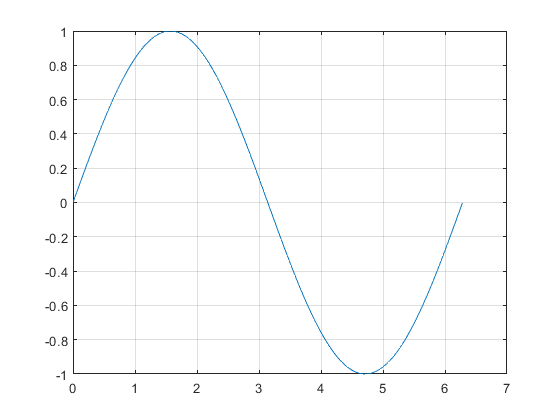
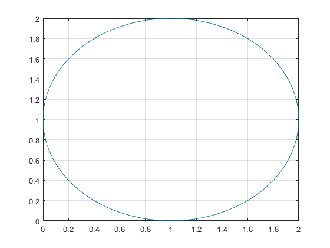

## What is a Function?

```{r global_options, include = FALSE}
try(source('../.Rprofile'))
```

`r text_shared_preamble_one`
`r text_shared_preamble_two`
`r text_shared_preamble_thr`

**function/mapping**: a mapping (also called a function) is a rule that
assigns to every element x of a set X a single element of a set Y. It is
written as:

$$f:X\to Y$$

where the arrow indicates mapping, and the letter $f$ symbolically
specifies a rule of mapping. When we write:

$$y=f(x)$$

we are mapping from argument $x$ in domain $X$ to value $y$ in co-domain
Y.

***Definitions:***

-   **domain**: big $X$ is the domain of $f$

-   **argument**: little $x$ is an element in big $X$, an argument of
    the function $f$.

-   **co-domain**: big $Y$ is the co-domain of $f$.

-   **image/value**: when $y=f(x)$, we refer to $y$ as the image or
    value of $x$ under $f$.

-   **range**:
    $f(X)=\lbrace y\in Y:y=f(x)\;\textrm{for}\;\textrm{some}\;x\in X\rbrace$

In some textbooks, $x$ is called independent or exogenous variables, and
$y$ is called dependent or endogenous variables. We will avoid using
those words to avoid confusion.

***This is a function***:

    figure();
    x = 0:pi/100:2*pi;
    y = sin(x);
    plot(x,y);
    grid on;

{width=500px}

***This is NOT a function***:

    figure();
    x = 1; y=1; r=1;
    th = 0:pi/50:2*pi;
    xunit = r * cos(th) + x;
    yunit = r * sin(th) + y;
    h = plot(xunit, yunit);
    grid on;

{width=500px}
