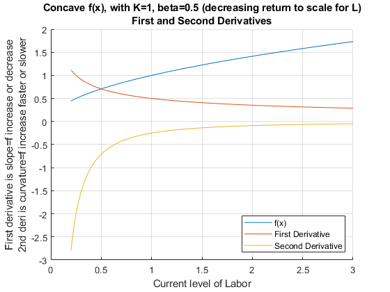
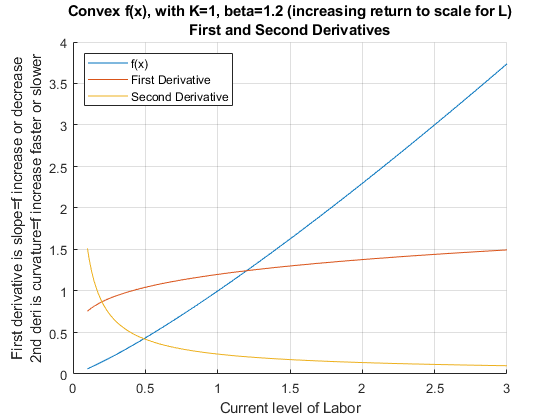

## Higher Order Derivatives--Cobb Douglas

```{r global_options, include = FALSE}
try(source('../.Rprofile'))
```

`r text_shared_preamble_one`
`r text_shared_preamble_two`
`r text_shared_preamble_thr`

We have the following general form for the Cobb-Douglas Production
Function

$$Y(K,L)=K^{\alpha } \cdot L^{\beta }$$

The first order condition is

$$\frac{dY(K,L)}{dL}=(\beta )\cdot K^{\alpha } \cdot L^{\beta -1}$$

The derivative we have obtained is just another function. We can take
additional derivatives with respect to this function.

$$\frac{{\textrm{d}}^2 Y(K,L)}{dL^2 }=(\beta )\cdot (\beta -1)\cdot K^{\alpha } \cdot L^{\beta -2}$$

Matlab symbolic toolbox gives us the same answer:

    syms L K0 alpha beta
    f(L, K0, alpha) = K0^(alpha)*L^(beta);
    frsDeri = diff(f, L)

frsDeri(L, K0, alpha) =
$\displaystyle {K_0 }^{\alpha } \,L^{\beta -1} \,\beta$

    secDeri = diff(diff(f, L),L)

secDeri(L, K0, alpha) =
$\displaystyle {K_0 }^{\alpha } \,L^{\beta -2} \,\beta \,{\left(\beta -1\right)}$

You can specify an additional parameter for the matlab *diff* function,
if we want to take multiple derivatives:

    syms L K0 alpha beta
    f(L, K0, alpha) = K0^(alpha)*L^(beta);
    % 5 for 5th derivative
    tenthDeri = diff(f, L, 5)

tenthDeri(L, K0, alpha) =
$\displaystyle {K_0 }^{\alpha } \,L^{\beta -5} \,\beta \,{\left(\beta -1\right)}\,{\left(\beta -2\right)}\,{\left(\beta -3\right)}\,{\left(\beta -4\right)}$

### Curvature and Second Derivative, Concave Function

Let's graph out the second derivative when $\beta =0.5$. The production
function is concave (concave down). For a function that is twice
continuously differentiable, the function is convex if and only if its
second derivative is non-positive (never accelerating).

    alpha = 0.5;
    beta = 0.5;
    K0 = 1;
    % Note that we have 1 symbolic variable now, the others are numbers
    syms L
    f(L) = K0^(alpha)*L^(beta);
    % note fDiff1L >= 0 always
    fDiff1L = diff(f, L)

fDiff1L(L) = $\displaystyle \frac{1}{2\,\sqrt{L}}$

    % note fDiff2L <= 0 always
    fDiff2L = diff(f, L, 2)

fDiff2L(L) = $\displaystyle -\frac{1}{4\,L^{3/2} }$

    % Start figure
    figure();
    hold on;
    % fplot plots a function with one symbolic variable
    fplot(f, [0.2, 3])
    fplot(fDiff1L, [0.2, 3])
    fplot(fDiff2L, [0.2, 3])
    title({'Concave f(x), with K=1, beta=0.5 (decreasing return to scale for L)' 'First and Second Derivatives'})
    ylabel({'First derivative is slope=f increase or decrease' '2nd deri is curvature=f increase faster or slower'})
    xlabel('Current level of Labor')
    legend(['f(x)'], ['First Derivative'], ['Second Derivative'], 'Location','SE');
    grid on

{width=500px}

### Curvature and Second Derivative, Convex Function

Let's graph out the second derivative when $\beta =1.2$. The production
function is convex (concave up). For a function that is twice
continuously differentiable, the function is convex if and only if its
second derivative is non-negative (never decelerating).

    alpha = 0.5;
    beta = 1.2;
    K0 = 1;
    % Note that we have 1 symbolic variable now, the others are numbers
    syms L
    f(L) = K0^(alpha)*L^(beta);
    % Note here fDiff1L >= 0
    fDiff1L = diff(f, L)

fDiff1L(L) = $\displaystyle \frac{6\,L^{1/5} }{5}$

    % Note here fDiff2L >= 0
    fDiff2L = diff(f, L, 2)

fDiff2L(L) = $\displaystyle \frac{6}{25\,L^{4/5} }$

    % Start figure
    figure();
    hold on;
    % fplot plots a function with one symbolic variable
    fplot(f, [0.1, 3])
    fplot(fDiff1L, [0.1, 3])
    fplot(fDiff2L, [0.1, 3])
    title({'Convex f(x), with K=1, beta=1.2 (increasing return to scale for L)' 'First and Second Derivatives'})
    ylabel({'First derivative is slope=f increase or decrease' '2nd deri is curvature=f increase faster or slower'})
    xlabel('Current level of Labor')
    legend(['f(x)'], ['First Derivative'], ['Second Derivative'], 'Location','NW');
    grid on

{width=500px}

\vspace{1em}
