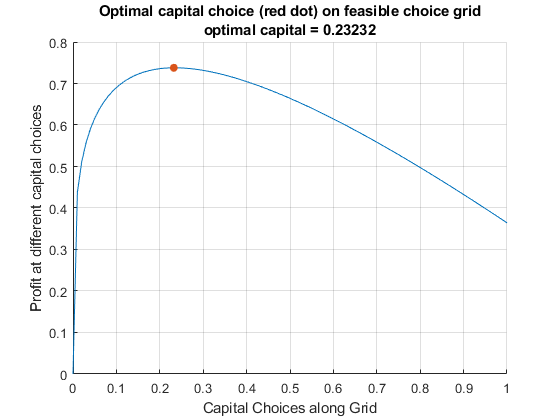

## Profit Maximization over Capital and Labor

```{r global_options, include = FALSE}
try(source('../.Rprofile'))
```

`r text_shared_preamble_one`
`r text_shared_preamble_two`
`r text_shared_preamble_thr`

### Model Components and Maximization Problem

Assume that the firm has fixed free labor, but can choose capital input.
At the start of a period, a firm rents capital inputs and combines
capital with labor to produce. At the end of the period, the firm sells
its output and pays interest rates based on how much capital it rented
(no wage costs). Profit is denoted by π, period interest rate is $r$,
the price of output is $p$, the firm makes $y$ units of output, and the
production function is Cobb-Douglas: $A\cdot K^{\alpha } \cdot L^{0.5}$

-   **Profit:** $\Pi =p\cdot A\cdot K^{\alpha } \cdot L^{0.5} -r\cdot K$

**Profit Maximization:**

-   $\displaystyle \max_K \left(p\cdot A\cdot K^{\alpha } \cdot L^{0.5} -r\cdot K\right)$

The $r$ here is just the interest on loans, in another word, if the
borrowing rate is 2 percent, $r=0.02$. Alternatively, one could replace
the $r$ in the equation above by $1+r$. The implication of just having
$r$ is that the $K$ that was borrowed could be resold and so the firm
does not need to generate revenue to pay for the principle borrowed,
only the interest rate. If however, during the process of production,
ther capital depreciates, then the firm would have to pay back more than
$r$. In the extreme case where the capital fully gets used up and can
not be resold for any value, then the cost term in the equation above
becomes: $(1+r)\cdot K$.

### Finding Optimal Choices--Brute Force Grid

We can visualize the solution here like we do for the household savings
problem

    clear all;
    alpha=0.25;
    A=1;
    r=1.05;
    p=1;
    L=2;
    choice_grid_count=100;
    capital_grid=linspace(0, 1,choice_grid_count);
    profit_at_capitalgrid=p*A*(capital_grid.^alpha)*(L^0.5)-(r*capital_grid);
    [max_profit, max_profit_index]=max(profit_at_capitalgrid);
    max_profit

    max_profit = 0.7379

    max_profit_index

    max_profit_index = 24

    optimal_capital_choice = capital_grid(max_profit_index);
    figure();
    hold on;
    plot(capital_grid, profit_at_capitalgrid);
    scatter(optimal_capital_choice, max_profit, 'filled');
    xlabel('Capital Choices along Grid');
    ylabel('Profit at different capital choices');
    title({'Optimal capital choice (red dot) on feasible choice grid';...
     ['optimal capital = ', num2str(optimal_capital_choice)]});
    grid on;

{width=500px}

### Analytical Solution

You can use the symbolic toolbox to take derivative and find root:

    syms r p alpha L K A
    fpi = p*A*K^(alpha)*L^0.5 - r*K

fpi = $\displaystyle A\,K^{\alpha } \,\sqrt{L}\,p-K\,r$

    dPIdK = diff(fpi, K)

dPIdK = $\displaystyle A\,K^{\alpha -1} \,\sqrt{L}\,\alpha \,p-r$

    KOpti = solve(dPIdK == 0, K, 'REAL',true)

    Warning: Solutions are valid under the following conditions: 0 < r/(A*L^(1/2)*alpha*p) & in((r/(A*L^(1/2)*alpha*p))^(1/(alpha - 1)), 'real'). To include parameters and conditions in the solution, specify the 'ReturnConditions' value as 'true'.

KOpti =
$\displaystyle {{\left(\frac{r}{A\,\sqrt{L}\,\alpha \,p}\right)}}^{\frac{1}{\alpha -1}}$

### Demand Curve For Capital

With the optimal capital choice as a function of interest rate, we can
plot out the demand for capital.

    p=1.15; %From the question.
    L=2; %From the question.
    A=3; %You can pick a random number.
    alpha=0.45; %You can pick a random number.
    grid_points = 21;
    % Vector of interest rates
    r = linspace(1.0,1.2,grid_points);
    % Demand Curve
    K= (r/(p*A*alpha*(L^0.5))).^(1/(alpha-1));
    % Plot
    figure();
    plot(K,r);
    xlabel('Capital (Borrowed from Banks)');
    ylabel('Interest Rate');
    title({'Inverse Demand For Capital'});
    grid on;

{width=500px}

### Demand and Supply Intersection

Combining the Firm's problem here, and the household's problem from the
other file, we have the equilibrium result.

Note that you should adjust your interest rate range so that you can see
the intersection. For the problem here, there exists an interest rate
that clears the market for capital.

    z=10;% from household problem
    beta=0.80; % from household problem
    p=1.15; %From the question.
    L=2; %From the question.
    A=3; %You can pick a random number.
    alpha=0.45; %You can pick a random number.
    grid_points = 21;
    % Vector of interest rates
    r = linspace(1.0,1.2,grid_points);
    % Demand Curve
    Demand = (r/(p*A*alpha*(L^0.5))).^(1/(alpha-1));
    Supply = (z*beta*(1+r)-(z/2))./((1+r)*(1+beta));
    % Plot
    figure();
    hold on;
    plot(Demand,r);
    plot(Supply,r);
    xlabel('Capital Demand and Supply');
    ylabel('Interest Rate');
    title({'Inverse Demand and Supply For Capital'});
    legend({'Demand', 'Supply'});
    grid on;

{width=500px}
