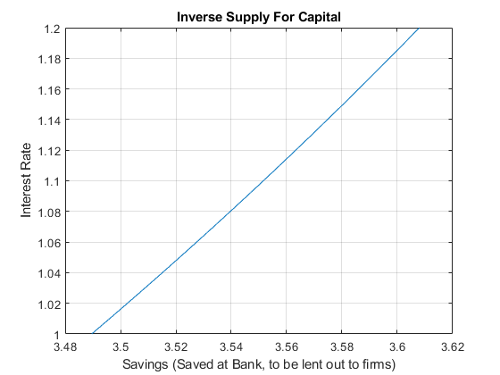

## Utility Maximization and Intertemporal Consumption

```{r global_options, include = FALSE}
try(source('../.Rprofile'))
```

`r text_shared_preamble_one`
`r text_shared_preamble_two`
`r text_shared_preamble_thr`

### Model Components and Maximization Problem

Suppose we have a household who will $z_2$ income tomorrow, and has
$z_1$ dollar income income today. He needs to determine how much to
save/borrow. There is no uncertainty in this problem, we solve the
problem with uncertainty again in: [Protofolio Choice: Investments in
Risky (stocks) and Safe (bank) Assets, and Financing Risky Investments
with Bank
Loans](https://fanwangecon.github.io/Math4Econ/nonlinear/RiskyAsset.html).

We can write down the model where we maximize utility over choices
$c_{today} ,c_{tomorrow}$:

-   **Utility**:
    $U(c_{today} ,c_{tomrrow} )=\log (c_{today} )+\beta \cdot \log (c_{tomorrow} )$

-   **Budget Today**: $c_{today} +b=z_1$

-   **Budget Tomorrow**: $c_{tomorrow} =b\cdot (1+r)+z_2$

We can rewrite the problem as:

-   $\displaystyle \max_b \left\lbrace \log (z_1 -b)+\beta \log (b\cdot (1+r)+z_2 )\right\rbrace$

*Note*: the only choice in this model is $b$, that will determine
consumption today and tomorrow.

*Note*: Does the interest rate have any effects when there are no
inheritances in the second period ($z_2 =0$)? Change the second period
inheritances in the code below to analyze the effect of interest rate.

### Open set for Choice set

Even though the budget constraint seems to allow for $0$ consumption
today and tomorrow, but $\log$ utility is not defined at $0$, hence the
maximization problem is undefined at $c_{today} =0$ and
$c_{tomorrow} =0$. Hence, the actual choice set for $save$ is an open
interval:

-   $b\in \left(-\frac{z_2 }{1+r},z_1 \right)$, (*which means* $0$ *and*
    $b$ *are not in the domain*)

Our Maximization problem is hence:

-   $\displaystyle \max_{b\in \left(-\frac{z_2 }{1+r},z_1 \right)} \left\lbrace \log (z_1 -b)+0.95\log (b\cdot (1+0.03)+z_2 )\right\rbrace$

If you choose save $z_1$ or more, consumption today will be undefined
(death today). If you borrow more than endowment tomorrow divided by
interest rate, you will not be able to pay back your debts (we assume no
default). Given this choice set, we could view this as a constrained
maximization problem, but the constraints never bind.

### Finding Optimal Choices--Brute Force Grid

A brute-force way of solving for this problem is to generate a vectors
of values for saving between 0 and b, but not including them, evaluate
the utility function at these values, and then find the max. This method
works when there are more choices as well. Experiment with the following
function by adjusting the parameters, including the discount factor,
interest rate, and wealth in the first and second period.

    % Model Parameters
    beta = 0.95;
    r = 0.05;
    wealth_1 = 10;
    wealth_2 = 1;
    % Generate a Vector of Points
    choice_grid_count = 1000;
    % This creates 100 equi-distance points, not at 0 and b, but between 0 and b
    save_grid = linspace(-wealth_2/(1+r)+0.0001, wealth_1-0.0001, choice_grid_count);
    % Evaluate utility
    utility_at_savegrid = log(wealth_1 - save_grid) + beta*log(wealth_2 + save_grid*(1+r));
    % Find Max
    [max_utility, max_utility_index] = max(utility_at_savegrid);
    % max_utility is the highest utility onthe choice grid
    max_utility

    max_utility = 3.3628

    % out of the choice grid points, which nth choice grid gives highest utility
    max_utility_index

    max_utility_index = 488

    % we can find the savings level at the index
    optimal_savings_choice = save_grid(max_utility_index)

    optimal_savings_choice = 4.3868

    % Plot
    figure();
    hold on;
    plot(save_grid, utility_at_savegrid);
    scatter(optimal_savings_choice, max_utility, 'filled');
    xlabel('Borrow Save Choices along Grid');
    ylabel('Utility at different savings choices');
    title({'Optimal Borrow Save choice (red dot) on feasible choice grid';...
          ['optimal Borrow Save = ', num2str(optimal_savings_choice)]});
    xlim([-wealth_2/(1+r), wealth_1])  
    plot(ones(size(save_grid))*0, utility_at_savegrid, 'k--');
    grid on;

{width=500px}

### Analytical Solution

You can use the symbolic toolbox to take derivative and find root:

    syms z beta r x
    funcU = log(z - x) + beta*log((z/2) + x*(1+r))

funcU =
$\displaystyle \log \left(z-x\right)+\beta \,\log \left(\frac{z}{2}+x\,{\left(r+1\right)}\right)$

    dUdx = diff(funcU, x)

dUdx =
$\displaystyle \frac{1}{x-z}+\frac{\beta \,{\left(r+1\right)}}{\frac{z}{2}+x\,{\left(r+1\right)}}$

    xOpti = solve(dUdx==0, x)

xOpti =
$\displaystyle \frac{2\,\beta \,z-z+2\,\beta \,r\,z}{2\,\beta +2\,r+2\,\beta \,r+2}$

### Supply Curve For Capital

With the optimal capital choice as a function of interest rate, we can
plot out the supply for capital.

    z=10;
    beta=0.92;
    grid_points = 21;
    % Rate Vector
    r = linspace(1.0,1.2,grid_points);
    % Supply Curve
    % use the . for division because it is a vector divided by another vector
    s=(z*beta*(1+r)-(z/2))./((1+r)*(1+beta));
    % Plot
    figure();
    plot(s,r);
    xlabel('Savings (Saved at Bank, to be lent out to firms)');
    ylabel('Interest Rate');
    title({'Inverse Supply For Capital'});
    grid on;

{width=500px}
