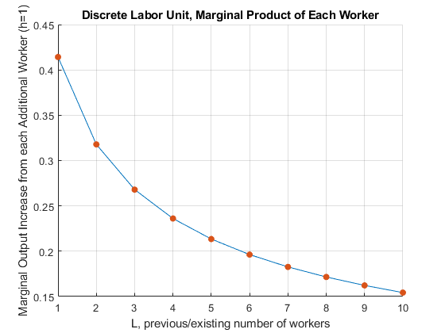
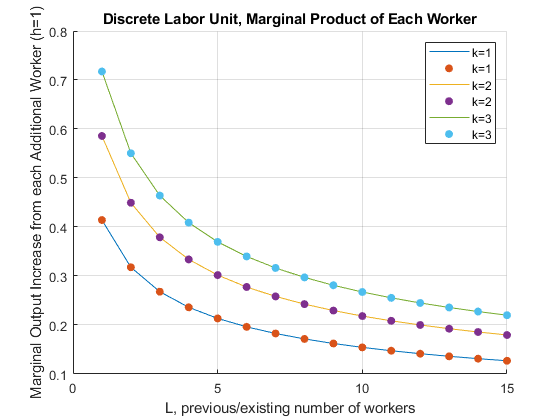

## Marginal Product of Labor

```{r global_options, include = FALSE}
try(source('../.Rprofile'))
```

`r text_shared_preamble_one`
`r text_shared_preamble_two`
`r text_shared_preamble_thr`

### Marginal Product of Additional Workers (Discrete Workers)

Suppose we can not hire fractions of workers, but have to hire 1, 2, 3,
etc.. What is the marginal product of each additional worker?

    % fixed capital level
    K = 1;
    % current labor level
    L = [1,2,3,4,5,6,7,8,9,10];

    % Cobb Douglas Production Parameters
    alpha = 0.5;
    beta = 1-alpha;

    % Output at x0
    fx0 = (K^alpha)*(L.^beta);

    % a vector of h
    h = 1;

    % output at fx0plush
    x0plush = L+h;
    fx0plush = (K^alpha)*((x0plush).^beta);

    % derivatie 
    outputIncrease = (fx0plush - fx0)./h;

    % Show Results in table
    T = table(L', x0plush', fx0plush', outputIncrease');
    T.Properties.VariableNames = {'L', 'x0plush', 'fx0plush', 'outputIncrease'};
    disp(T);

        L     x0plush    fx0plush    outputIncrease
        __    _______    ________    ______________

         1       2        1.4142        0.41421    
         2       3        1.7321        0.31784    
         3       4             2        0.26795    
         4       5        2.2361        0.23607    
         5       6        2.4495        0.21342    
         6       7        2.6458        0.19626    
         7       8        2.8284        0.18268    
         8       9             3        0.17157    
         9      10        3.1623        0.16228    
        10      11        3.3166        0.15435    


    % Graph
    close all;
    figure();
    hold on;
    plot(L, outputIncrease);
    scatter(L, outputIncrease,'filled');
    grid on;
    ylabel('Marginal Output Increase from each Additional Worker (h=1)')
    xlabel('L, previous/existing number of workers')
    title('Discrete Labor Unit, Marginal Product of Each Worker')

{width=500px}

### Using Derivative to approximate Increase in Output from More Workers

We know the MPL formula, so we can evaluate MPL at the vetor of L

    % fixed capital level
    K = 1;
    % current labor level
    L = [1,2,3,4,5,6,7,8,9,10];

    % Cobb Douglas Production Parameters
    alpha = 0.5;

    % Output at x0
    fprimeX0 = (1-alpha)*(K^alpha)*(L.^(-alpha));

    T = table(L', outputIncrease', fprimeX0');
    T.Properties.VariableNames = {'L', 'outputIncrease','fprimeX0'};
    disp(T);

        L     outputIncrease    fprimeX0
        __    ______________    ________

         1       0.41421            0.5 
         2       0.31784        0.35355 
         3       0.26795        0.28868 
         4       0.23607           0.25 
         5       0.21342        0.22361 
         6       0.19626        0.20412 
         7       0.18268        0.18898 
         8       0.17157        0.17678 
         9       0.16228        0.16667 
        10       0.15435        0.15811 

### Marginal Product of Additional Workers Different Capital (Discrete Workers)

Suppose we can not hire fractions of workers, but have to hire 1, 2, 3,
etc.. What is the marginal product of each additional worker?

    % fixed capital level
    K1 = 1;
    [fprimeX0K1, L] = MPKdiscrete(K1);
    K2 = 2;
    [fprimeX0K2, L] = MPKdiscrete(K2);
    K3 = 3;
    [fprimeX0K3, L] = MPKdiscrete(K3);

    % Graph
    close all;
    figure();
    hold on;
    plot(L, fprimeX0K1);
    scatter(L, fprimeX0K1,'filled');
    plot(L, fprimeX0K2);
    scatter(L, fprimeX0K2,'filled');
    plot(L, fprimeX0K3);
    scatter(L, fprimeX0K3,'filled');
    grid on;
    ylabel('Marginal Output Increase from each Additional Worker (h=1)')
    xlabel('L, previous/existing number of workers')
    title('Discrete Labor Unit, Marginal Product of Each Worker')
    legend(['k=',num2str(K1)], ['k=',num2str(K1)],...
        ['k=',num2str(K2)],['k=',num2str(K2)],...
    ['k=',num2str(K3)],['k=',num2str(K3)]);

{width=500px}

    function [fprimeX0, L] = MPKdiscrete(K)
    % current labor level
    L = [1,2,3,4,5,6,7,8,9,10,11,12,13,14,15];

    % Cobb Douglas Production Parameters
    alpha = 0.5;
    beta = 1-alpha;

    % Output at x0
    fx0 = (K^alpha)*(L.^beta);

    % a vector of h
    h = 1;

    % output at fx0plush
    x0plush = L+h;
    fx0plush = (K^alpha)*((x0plush).^beta);

    % derivatie 
    fprimeX0 = (fx0plush - fx0)./h;

    end
