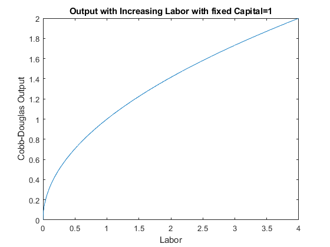
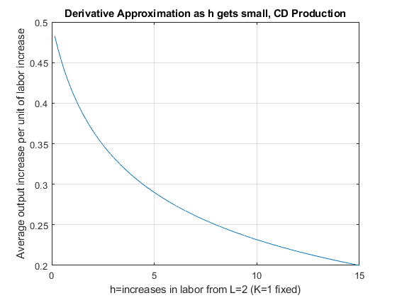

## Derivative Approximation of Marginal Product

```{r global_options, include = FALSE}
try(source('../.Rprofile'))
```

`r text_shared_preamble_one`
`r text_shared_preamble_two`
`r text_shared_preamble_thr`

Given the analytical formula for derivative. We can compute the value of
the formula at different $h$.

$$f^{\prime } (x_0 )=\lim_{h\to 0} \frac{f(x_0 +h)-f(x_0 )}{h}$$

### Cobb-Douglas--Output as a Function of Capital

Let's consider a cobb-douglas production function again.

If you own a firm, you would be very interested in how much additional
output you can get from one more unit of capital of one more labor
hired. If you know that, you can compare that against the cost of more
capital and labor and determine if it is optimal to choose to increase
capital and/or labor.

$$F(K,L)=K^{\alpha } \cdot L^{1-\alpha }$$

For now, let's fix capital. Suppose capital takes a long time to adjust,
but labor can be adjusted. You currently have $K=1$ and $L=1$, what
happens to output if you increase labor?

    clear all;
    % Define Production Function as a function of K, with fixed L
    alpha = 0.5;
    beta = 0.5;
    K = 1;
    syms L
    f(L) = (K^alpha)*(L.^beta);
    % Graph Production Function with Fixed L
    figure();
    fplot(f, [0,4]);
    ylabel('Cobb-Douglas Output');
    xlabel('Labor');
    title(['Output with Increasing Labor with fixed Capital=', num2str(K)])

{width=500px}

### Cobb-Douglas--Tangent line as h gets smaller

Following the definition above, if we want to measure the slope of the
output line at $K=1$, we need to calculate slope over run as $h$ gets
smaller

    % Define parameters and K0
    alpha = 0.5;
    beta = 0.5;
    L0 = 1;
    K = 1;
    Y_at_L0 = (K^alpha)*(L0^beta);
    x_max = 5;
    x_min = 0;

    % a vector of h vectors
    h_vec = [0.01, 1, 3];
    % Loop over h, generate a plot for each rise over run as h changes
    figure();
    hold on;
    % Legend
    Legend_list = {};
    % Plot as before the production function as a function of K
    syms L
    f(L) = (K^alpha)*(L^beta);
    fplot(f, [x_min, x_max], 'LineWidth', 2);
    % Add to Legend List
    legend_counter = 1;
    Legend_list{1} = ['Actual Line'];
    % Plot the other lines
    for h=h_vec
        f_l0 = (K^alpha)*(L0^beta);
        f_l0_plus_h = (K^alpha)*((L0+h)^beta);
        % Current approximating line slope, based on formula above
        cur_slope = (f_l0_plus_h - f_l0)/h;
        % Current approximating line y-intercept, we require line to cross (K0, Y_at_K0), and know slope already
        cur_y_intercept = Y_at_L0 - cur_slope*L0;
        % Plot each of the approximating Slopes
        syms L
        f(L) = cur_y_intercept + cur_slope*L;
        fplot(f, [x_min, x_max], '--');
        plot([h+L0, h+L0], ylim, '-k');
        % Legend
        legend_counter = 1 + legend_counter;
        Legend_list{legend_counter} = ['h=' num2str(h) ', slope=' num2str(cur_slope)];
    end
    grid on;
    ylabel('Cobb-Douglas Output');
    xlabel('Labor');
    title({'Tangent line as h gets smaller'...
           ,['Output with Increasing Labor, fixed Capital=' num2str(K)]})
    legend(Legend_list,'Location', 'NW','Orientation' ,'Vertical' );

{width=500px}

At different $h$, the approximating slope formula is calculating output
per additional worker given $h$ increase in workers. Below are the
slopes of the dashed lines in the figure above for a wider range of $h$
values.

    % a bigger evenly spaced vector of h
    h_grid_count = 100;
    h = linspace(0, 15, h_grid_count);

    % output at f_x0_plus_h
    x0_plus_h = L0+h;
    f_x0 = (K^alpha)*(L0.^beta);
    f_x0_plus_h = (K^alpha)*((x0_plus_h).^beta);
    % average output per additional worker
    f_prime_x0 = (f_x0_plus_h - f_x0)./h;

    % Store Results in a Table
    T = table(h', x0_plus_h', f_x0_plus_h', f_prime_x0');
    T.Properties.VariableNames = {'h', 'x0_plus_h', 'f_x0_plus_h', 'f_prime_x0'};

    % Graph
    close all;
    figure();
    plot(h, f_prime_x0);
    grid on;
    ylabel('Average output increase per unit of labor increase')
    xlabel('h=increases in labor from L=2 (K=1 fixed)')
    title('Derivative Approximation as h gets small, CD Production')

{width=500px}

\vspace{1em}
