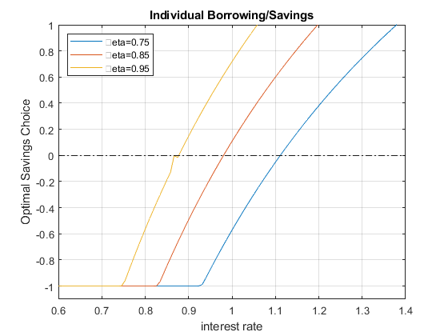
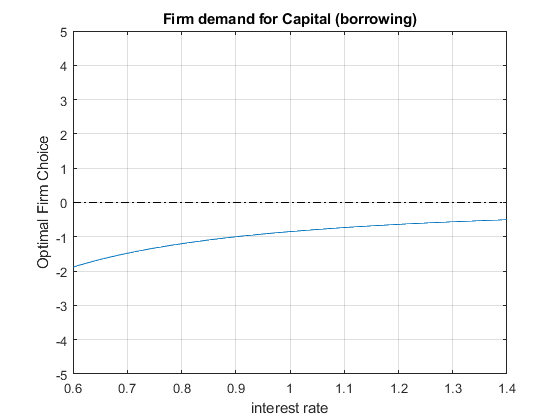
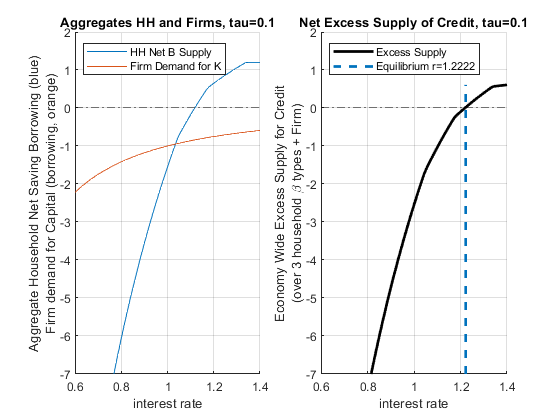

## Equilibrium Interest Rate and Tax

[**Back to Fan's Math for Economist Table of
Content**](https://fanwangecon.github.io/Math4Econ/)

We have previous solved the household's asset supply problem with a
[borrowing
constraint](https://fanwangecon.github.io/Math4Econ/optimization_application/household_borrow_constrained.html).
And also the firm's [asset demand
problem](https://fanwangecon.github.io/Math4Econ/derivative_application/K_borrow_firm.html).
We used first order taylor approximation to solve for the [approximate
equilibrium interest
rate](https://fanwangecon.github.io/Math4Econ/matrix_application/demand_supply_taylor_approximate_capital.html)
before for the firm's asset demand problem and for the households'
[savings problem without borrowing
constraint](https://fanwangecon.github.io/Math4Econ/derivative_application/K_save_households.html).
Here we find equilibrium interest rate with the constrained borrowing
problem. I will analyze the effect of an interest rate (borrowing) rate
subsidy for firms and borrowing households that is paid for by savings
tax.

### How do households with different $\beta$ respond to changes in $r$ given Borrowing Constraint?

Following our previous
[discussions](https://fanwangecon.github.io/Math4Econ/optimization_application/household_borrow_constrained.html),
the household's borrowing constrained problem is:

-   specifically:
    $\max_b \log (Z_1 -b)+\beta_i \cdot \log (Z_2 +b\cdot (1+r))$

-   with: $b\ge \bar{b}$

I introduce now heterogeneity in $\beta$. There are $N=3$ households,
each with a different $\beta_i$. Note that lower $\beta$ household at
the same interest rate $r$ will be more interested in borrowing rather
than saving. The households have the same $Z$ and face the same
$\bar{b}$. Look at the graph below, at some interest rate, all three
households want to borrow, at other rates, some want to borrow and
others want to save.

    clear all
    % Parameters
    z1 = 12;
    z2 = 10;
    b_bar_num = -1; % borrow up to 1 dollar

    % Vector of 3 betas
    beta_vec = [0.75 0.85 0.95];
    % Vector of interest rates
    r_vec = linspace(0.6, 1.40, 100);

    % What we had from before to use fmincon
    A = [-1];
    q = -b_bar_num;
    b0 = [0]; % starting value to search for optimal choice

    % A vector to store optimal choices
    rows = length(r_vec);
    cols = length(beta_vec);
    b_opti_mat = zeros(rows, cols);
    % Solving for optimal choices as we change Z2
    for j=1:1:length(beta_vec)
        for i=1:1:length(r_vec)
            U_neg = @(x) -1*(log(z1 - x(1)) + beta_vec(j)*log(z2 + x(1)*r_vec(i)));
            options = optimoptions('FMINCON','Display','off');
            [x_opti,U_at_x_opti] = fmincon(U_neg, b0, A, q, [], [], [], [], [], options);
            b_opti_mat(i, j) = x_opti(1);
        end
    end
    % Plot Results
    legendCell = cellstr(num2str(beta_vec', '\beta=%3.2f'));
    figure()
    % Individual Demands at different Interest Rate Points
    plot(r_vec, b_opti_mat)
    ylim([-1.1 1]);
    xlim([min(r_vec) max(r_vec)]);
    hold on
    plot(r_vec,ones(size(r_vec)) * 0, 'k-.');
    grid on;
    title('Individual Borrowing/Savings')
    ylabel('Optimal Savings Choice')
    xlabel('interest rate')
    legend(legendCell, 'Location','northwest');

{width=500px}

### Aggregate Household Excess Supply along Interest Rate

When we solved for the [equilibrium interest rate
before](https://fanwangecon.github.io/Math4Econ/matrix_application/demand_supply_taylor_approximate_capital.html),
we had a firm that demanded credit and a household that supplied credit.
Now we are more flexible, as shown in the chart above, households could
be supplying or demanding credit. The equilibrium now is about clearing
the aggregate demand and supply for the credit market considering both
firms and households where households now could either be on demand or
supply side. At a particular $r$, if households all want to borrow,
there will be no lending, so that particular interest rate will not
clear market. We will increase interest rate until some households are
willing to save. Eventually, we find the market clearning interest rate.

If the economy has on the household side exactly these three households,
we can sum the aggregate demand and supply for credit at each $r$ from
the households by summing across the $b^* (r,\beta_i )$. If households
with these three different discount factors are in different proportions
in the data for a particular country, we can sum up the weighted
average.

-   **Aggregate Household Excess Supply**:
    $B_{hh}^* =\sum_{i=1}^3 b^* (r,\beta_i )$

<!-- -->

    figure()
    hold on;
    % Aggregate demand (borrow meaning negative) and supply (saving positive) for households,
    % just add sum (the 2 means sum over columns), it will sum across columns, each column is a different individual
    plot(r_vec, sum(b_opti_mat, 2))
    plot(r_vec,ones(size(r_vec)) * 0, 'k-.');
    ylim([-5 5]);
    xlim([min(r_vec) max(r_vec)]);
    grid on;
    title('Aggregates Households')
    ylabel({['Aggregate Household Net Saving Borrowing'], ['(over 3 household \beta types)']})
    xlabel('interest rate')
    legend({'HH Net B Supply'}, 'Location','northwest');

{width=500px}

### Firm Demand for Credit

We also have the aggregate Demand for the firm side based on the [firm's
capital only
problem](https://fanwangecon.github.io/Math4Econ/matrix_application/KL_borrowhire_firm.html),
with $\alpha_l$ for elasticity of labor, and $\alpha_k$ for elasticity
of capital, and $L$ is fixed at 1:

-   **Firm Demand For Capital**:
    $K_{firm}^* ={\left(\frac{r}{p\cdot A\cdot \alpha \cdot L^{\alpha_l } }\right)}^{\frac{1}{\alpha_k -1}}$

<!-- -->

    figure()
    % Aggregate demand from firms (borrowing from firms)
    p = 1;
    A = 2.5;
    alpha_K = 0.36;
    alpha_L = 0.5;
    L = 1;
    FIRM_K = (r_vec./(p*A*alpha_K*(L^alpha_L))).^(1/(alpha_K-1));
    % Individual Demands at different Interest Rate Points
    plot(r_vec, (-1)*FIRM_K)
    ylim([-5 5]);
    xlim([min(r_vec) max(r_vec)]);
    hold on
    plot(r_vec,ones(size(r_vec)) * 0, 'k-.');
    grid on;
    title('Firm demand for Capital (borrowing)')
    ylabel('Optimal Firm Choice')
    xlabel('interest rate')

{width=500px}

### Economy Wide Excess Supply for Credit (Firm + Households)

The firm is demanding credit (it is borrowing), so we put a negative
sign in front of $K$ demanded:

-   **Economy-wide excess supply of Credit**:
    $\textrm{ExcesCreditSupply}(r)=B_{hh}^* (r)-K_{firm}^* (r)$

-   If the term above is positive that means total saving from
    households is greater than total borrowing from households and
    firms.

Equilibrium interest rate is the interest rate where excess credit
supply is equal to zero:

-   to find **equilibrium interest rate**: find $r^{equi}$, where at
    this interest rate: $B_{hh}^* (r^{equi} )-K_{firm}^* (r^{equi} )=0$

<!-- -->

    % Summing up to get excess credit supply
    excess_credit_supply = (sum(b_opti_mat, 2) + (-1)*FIRM_K');
    % find at which interest rate we are closest to zero
    [excess_credit_supply_at_equi, equi_idx_in_rvec] = min(abs(excess_credit_supply));
    equilibrium_r = r_vec(equi_idx_in_rvec);
    lowbeta_hh_b_equi = b_opti_mat(equi_idx_in_rvec, 1);
    midbeta_hh_b_equi = b_opti_mat(equi_idx_in_rvec, 2);
    highbeta_hh_b_equi = b_opti_mat(equi_idx_in_rvec, 3);
    FIRM_K_equi = -FIRM_K(equi_idx_in_rvec);
    results_withno_tax = table(equilibrium_r, excess_credit_supply_at_equi, equi_idx_in_rvec, FIRM_K_equi, lowbeta_hh_b_equi, midbeta_hh_b_equi, highbeta_hh_b_equi);
    disp(results_withno_tax)

        equilibrium_r    excess_credit_supply_at_equi    equi_idx_in_rvec    FIRM_K_equi    lowbeta_hh_b_equi    midbeta_hh_b_equi    highbeta_hh_b_equi
        _____________    ____________________________    ________________    ___________    _________________    _________________    __________________

           1.0364                  0.022569                     55            -0.80217          -0.37092              0.29777              0.89789      

Note that our equilibrium is an approximation, because we only had a
grid of $r$, the excess total supply is $0.023$, which is close to $0$,
but not actualy $0$. The numbers above show that our equilibrium
interest rate is approximately $1.036$, and at this equilibrium out of
our three households and firm:

1.  the firm borrows: $0.80217$ (this is $K$, based on which we can find
    total output $Y$)

2.  household 1 borrow: $0.37$

3.  household 2 saves: $0.30$

4.  household 3 saves: $0.89$

These sum up to approximately $0$. Note that none of our three
households is borrowing constrained at the equilibrium. We can redraw
the chart earlier and show the aggregate demand and supply for credit
$B_{hh}$ from the household side:

    figure()
    subplot(1,2,1)
    hold on;
    % Aggregate demand (borrow meaning negative) and supply (saving positive) for households, 
    % just add sum (the 2 means sum over columns), it will sum across columns, each column is a different individual
    plot(r_vec, sum(b_opti_mat, 2))
    plot(r_vec, (-1)*FIRM_K)
    plot(r_vec,ones(size(r_vec)) * 0, 'k-.');
    ylim([-5 5]);
    xlim([min(r_vec) max(r_vec)]);
    grid on;
    title('Aggregates HH and Firms')
    ylabel({['Aggregate Household Net Saving Borrowing (blue)'], ['Firm demand for Capital (borrowing, orange)']})
    xlabel('interest rate')
    legend({'HH Net B Supply', 'Firm Demand for K'}, 'Location','northwest');
    subplot(1,2,2)
    hold on;
    % Total Aggregate Net Demand for Credit at each R
    plot(r_vec, excess_credit_supply, 'k', 'LineWidth', 2);
    % Plot equilibrium interest rate line
    plot(equilibrium_r*ones(1,10), linspace(min(excess_credit_supply), max(excess_credit_supply),10), '--', 'LineWidth', 2);
    % Zero line
    plot(r_vec,ones(size(r_vec)) * 0, 'k-.');
    ylim([-5 5]);
    xlim([min(r_vec) max(r_vec)]);
    grid on;
    title('Net Excess Supply of Credit')
    ylabel({['Economy Wide Excess Supply for Credit'], ['(over 3 household \beta types + Firm)']})
    xlabel('interest rate')
    legend({'Excess Supply', ['Equilibrium r=' num2str(equilibrium_r)]}, 'Location','northwest');

{width=500px}

### Demand and Supply for Credit with a Tax on Interest Rate

Suppose some government officials thinks we need to subsidize borrowing.
They want to make it easier for households to borrow and also for firms
to borrow. This sounds fantastic. Because if borrowing rate is lower for
firm, the firm can borrow more in physical capital and increase output.
How to pay for it? The officials decide to pay for it by taxing savings.
Perhaps people with too much savings can take a cut on their interest
rate earnings.

For the firm, this is just a discount on the borrowing rate. For
households, this means if you save, you get your principle back next
period, but you only get $1-\tau$ fraction of the interest rate earning.
But if you borrow, you only pay $1-\tau$ fraction of your interest,
rather than the full amount. Our problem remains the same as before,
except that we need to resolve given the tax rate now. Let's apply the
discount in borrowing to both households that borrow and firms that
borrow:

**Household problem** with borrowing discount and saving tax:

-   $\displaystyle \max_b \log (Z_1 -b)+\beta_i \cdot \log (Z_2 +b+b\cdot (r)(1-\tau ))$

**Firm** optimal Policy function with borrowing discount:

-   $\displaystyle K_{firm}^* ={\left(\frac{r\cdot (1-\tau )}{p\cdot A\cdot \alpha \cdot L^{\alpha_l } }\right)}^{\frac{1}{\alpha_k -1}}$

*Note:* this policy **pays for itself** because the credit market
clears, so government income from the savings tax will pay for exactly
its subsidy on borrowing.

Suppose $\tau =0.10$, let's solve for the new optimal choices and
equilibrium given this tax policy. We re-use our previous codes but
include now the tax:

    tau = 0.10;
    % Households' problem with Interest Tax and Subsidy
    % A vector to store optimal choices
    b_opti_mat = zeros(rows, cols);
    % Solving for optimal choices as we change Z2
    for j=1:1:length(beta_vec)
        for i=1:1:length(r_vec)
            U_neg = @(x) -1*(log(z1 - x(1)) + beta_vec(j)*log(z2 + x(1)*r_vec(i)*(1-tau)));
            options = optimoptions('FMINCON','Display','off');
            [x_opti,U_at_x_opti] = fmincon(U_neg, b0, A, q, [], [], [], [], [], options);
            b_opti_mat(i, j) = x_opti(1);
        end
    end

    % Firm's problem with interest tax and subsidy
    FIRM_K = ((r_vec*(1-tau))./(p*A*alpha_K*(L^alpha_L))).^(1/(alpha_K-1));

    % Approximate equilibrium
    excess_credit_supply = (sum(b_opti_mat, 2) + (-1)*FIRM_K');
    [excess_credit_supply_at_equi, equi_idx_in_rvec] = min(abs(excess_credit_supply));
    equilibrium_r = r_vec(equi_idx_in_rvec);

    % Grab Results
    lowbeta_hh_b_equi = b_opti_mat(equi_idx_in_rvec, 1);
    midbeta_hh_b_equi = b_opti_mat(equi_idx_in_rvec, 2);
    highbeta_hh_b_equi = b_opti_mat(equi_idx_in_rvec, 3);
    FIRM_K_equi = -FIRM_K(equi_idx_in_rvec);
    results_with_tax = table(equilibrium_r, excess_credit_supply_at_equi, equi_idx_in_rvec, FIRM_K_equi, lowbeta_hh_b_equi, midbeta_hh_b_equi, highbeta_hh_b_equi);
    results_table = [results_withno_tax;results_with_tax];
    results_table.Properties.RowNames = {'no r tax/subsidy', ['r tax/subsidy tau=' num2str(tau)]};
    disp(results_table)

                                 equilibrium_r    excess_credit_supply_at_equi    equi_idx_in_rvec    FIRM_K_equi    lowbeta_hh_b_equi    midbeta_hh_b_equi    highbeta_hh_b_equi
                                 _____________    ____________________________    ________________    ___________    _________________    _________________    __________________

        no r tax/subsidy            1.0364                  0.022569                     55            -0.80217           -0.37092             0.29777              0.89789      
        r tax/subsidy tau=0.1       1.2222                  0.017077                     78            -0.73085          -0.051952             0.39988                  0.4      

The table above compares the results with the tax and without. With the
tax, the approximate equilibrium interest rate has to be higher because
with the tax rate at the previous interest rate more people want to
borrow (given the borrowing discount) and less people want to save
(given the tax). To find the point where demand equals supply, interest
rate increases to incentivize households to save despite the tax. In
equilibrium, we now have a much higher interest rate that clears that
market. Note that compared to before, firms are borrowing less, so
output is now lower due to the higher equilibrium interest rate. The
policy is potentially having the opposite of its intended effect. We
solve for the general equilibrium effects of policies to help us think
about these unintended consequences of policies.

    figure()
    subplot(1,2,1)
    hold on;
    % Aggregate demand (borrow meaning negative) and supply (saving positive) for households, 
    % % just add sum (the 2 means sum over columns), it will sum across columns, each column is a different individual
    plot(r_vec, sum(b_opti_mat, 2))
    plot(r_vec, (-1)*FIRM_K)
    plot(r_vec,ones(size(r_vec)) * 0, 'k-.');
    ylim([-7 2]);
    xlim([min(r_vec) max(r_vec)]);
    grid on;
    title(['Aggregates HH and Firms, tau=' num2str(tau)])
    ylabel({['Aggregate Household Net Saving Borrowing (blue)'], ['Firm demand for Capital (borrowing, orange)']})
    xlabel('interest rate')
    legend({'HH Net B Supply', 'Firm Demand for K'}, 'Location','northwest');
    subplot(1,2,2)
    hold on;
    % Total Aggregate Net Demand for Credit at each R
    plot(r_vec, excess_credit_supply, 'k', 'LineWidth', 2);
    % Plot equilibrium interest rate line
    plot(equilibrium_r*ones(1,10), linspace(min(excess_credit_supply), max(excess_credit_supply),10), '--', 'LineWidth', 2);
    % Zero line
    plot(r_vec,ones(size(r_vec)) * 0, 'k-.');
    ylim([-7 2]);
    xlim([min(r_vec) max(r_vec)]);
    grid on;
    title(['Net Excess Supply of Credit, tau=' num2str(tau)])
    ylabel({['Economy Wide Excess Supply for Credit'], ['(over 3 household \beta types + Firm)']})
    xlabel('interest rate')
    legend({'Excess Supply', ['Equilibrium r=' num2str(equilibrium_r)]}, 'Location','northwest');

{width=500px}
