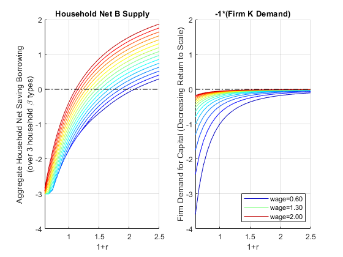
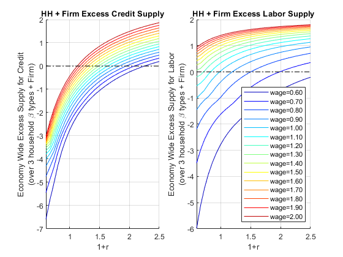

## Equilibrium Interest Rate and Wage Rate

[**Back to Fan's Math for Economist Table of
Content**](https://fanwangecon.github.io/Math4Econ/)

We have solved for the problem with [constrained labor and
saving/borrowing
choice](https://fanwangecon.github.io/Math4Econ/optimization_application/household_asset_labor_constrained.html),
and the problem with [saving/borrowing and
tax](https://fanwangecon.github.io/Math4Econ/equilibrium/equilibrium_constrainedborrow.html).

### Household and Firm's Problem

Following our previous
[discussions](https://fanwangecon.github.io/Math4Econ/optimization_application/household_asset_labor_constrained.html),
the household's borrowing constrained problem is:

-   specifically:
    $\max_{b,\textrm{work},\textrm{leisure}} \log (Z_1 +w\cdot \textrm{work}-b)+\psi \log (\textrm{leisure})+\beta \cdot \log (Z_2 +b\cdot (1+r))$

And the constraints are:

1.  $\displaystyle b\ge \bar{b}$

2.  $\displaystyle \textrm{work}\ge 0$

3.  $\displaystyle \textrm{leisure}\ge 0$

4.  $\textrm{work}+\textrm{leisure}\le T$, where $T$ is total time
    available

There are $N=3$ households, each with a different $\beta_i$.

For the firm, we have [solved
previously](https://fanwangecon.github.io/Math4Econ/matrix_application/KL_borrowhire_firm.html)
for the firm's optimal choices given $w$ and $r$:

-   $\displaystyle \max_{K,L} \left(p\cdot A\cdot K^{\alpha } \cdot L^{\beta } -r\cdot K-w\cdot L\right)$

### Setting Up Parameters

Solve with three different discount rates, and different $r$ and $w$.
First, let's set up some parameters. The firm here has decreasing return
to scale, let's ignore the issue of profit when looking for equilibrium.

    clear all

    % Parameters for the Household
    psi = 0.5;
    z1 = 1;
    z2 = 2;
    b_bar_num = -1; % borrow up to 1 dollar
    T = 1; % think about time as share of time in a year

    % Parameters for the firm
    p = 1;
    alpha = 0.3;
    beta = 0.5;
    Aproductivity = 2.0;

    % Vector of 3 betas
    beta_vec = [0.85 0.90 0.95];
    % Vector of interest rates
    R_vec = linspace(0.60, 2.50, 30);
    % Vector of wage rates, 3 wage rates for now
    W_vec = linspace(0.6, 2, 15);

    % What we had from before to use fmincon
    A = [-1,0,0;0,0,-1;0,-1,0;0,1,1];
    q = [-b_bar_num;0;0;T];
    b0 = [0,0.5,0.5]; % starting value to search for optimal choice

### Household Labor Supply and Borrow/Save with different $\beta$ and $r$ ?

[In the problem without labor
supply](https://fanwangecon.github.io/Math4Econ/equilibrium/equilibrium_constrainedborrow.html)
I showed different excess supply of credit for each $\beta_i$ household,
we can do the same here for excess credit supply, but that is too much
to show. I will just sum up the total across the households for both
excress credit supply and total work hours:

-   **Aggregate Household Excess Supply**:
    $B_{hh}^* (r,w)=\sum_{i=1}^3 b^* (r,w,\beta_i )$

-   **Aggregate Household Labor Supply**:
    ${\textrm{WORK}}_{hh}^* (r,w)=\sum_{i=1}^3 {\textrm{work}}^* (r,w,\beta_i )$

I store results in a matrix where each row correspond to an interest
rate level and each color a wage rate.

    % Various Matrixes to store optimal choices
    rows = length(R_vec);
    cols = length(W_vec);
    wage_dim_len = length(W_vec);
    b_opti_mat = zeros(rows, cols);
    worKOpti_mat = zeros(rows, cols);
    leisure_opti_mat = zeros(rows, cols);
    c1_opti_mat = zeros(rows, cols);
    c2_opti_mat = zeros(rows, cols);

    % Solving for optimal choices as we change Z2
    for i=1:1:length(R_vec)
        for j=1:1:length(W_vec)
            
            % Initialize aggregate household statistics given r and w
            agg_b_supply_at_w_r = 0;
            agg_work_at_w_r = 0;
            agg_leisure_at_w_r = 0;
            agg_c1_at_w_r = 0;
            agg_c2_at_w_r = 0;
            
            for h=1:1:length(beta_vec)
                % Solve
                U_neg = @(x) -1*(log(z1 + W_vec(j)*x(2) - x(1)) + psi*log(x(3)) + beta_vec(h)*log(z2 + x(1)*(R_vec(i))));
                options = optimoptions('FMINCON','Display','off');
                [x_opti,U_at_x_opti] = fmincon(U_neg, b0, A, q, [], [], [], [], [], options);
                % Sum up at current r and w for all households
                agg_b_supply_at_w_r = agg_b_supply_at_w_r + x_opti(1);
                agg_work_at_w_r = agg_work_at_w_r + x_opti(2);
                agg_leisure_at_w_r = agg_leisure_at_w_r + x_opti(3);
                agg_c1_at_w_r = agg_c1_at_w_r + z1 + W_vec(j)*x_opti(2) - x_opti(1);
                agg_c2_at_w_r = agg_c2_at_w_r + z2 + x_opti(1)*(R_vec(i));
            end
            
            % Store aggregate Household statistics
            b_opti_mat(i, j)  = agg_b_supply_at_w_r;
            worKOpti_mat(i, j)  = agg_work_at_w_r;
            leisure_opti_mat(i, j)  = agg_leisure_at_w_r;
            c1_opti_mat(i, j) = agg_c1_at_w_r;
            c2_opti_mat(i, j) = agg_c2_at_w_r;
        end
    end

### Firm's Demand for Capital and Labor

The firm's problem loops over $r$ and $w$, do not need to loop over
$\beta_i$. We get here:

-   **Firm Demand For Capital**: $K_{firm}^* (r,w)$

-   **Firm Demand For Labor**: $L_{firm}^* (r,w)$

<!-- -->

    % Various Matrixes to store optimal choices
    rows = length(R_vec);
    cols = length(W_vec);
    K_demand_mat = zeros(rows, cols);
    L_demand_mat = zeros(rows, cols);

    % We solved before optimal choices
    syms w r
    % Matrix Form of linear system, same as before
    B = [log(r/(p*Aproductivity*alpha)); log(w/(p*Aproductivity*beta))];
    A = [(alpha-1), beta;alpha, beta-1];
    % Solve linear equations, and then exponentiate, same as before
    % We can use the simplify command to simplify this solution, get rid of exp and log:
    lin_solu = simplify(exp(linsolve(A, B)));
    KOpti = lin_solu(1)

KOpti = $\displaystyle \frac{9\,\sqrt{15}}{125\,r^{5/2} \,w^{5/2} }$

    LOpti = lin_solu(2)

LOpti = $\displaystyle \frac{3\,\sqrt{15}}{25\,r^{3/2} \,w^{7/2} }$

    % Solving for optimal choices as we change Z2
    for i=1:1:length(R_vec)
        for j=1:1:length(W_vec)
            K_demand_mat(i,j) = subs(KOpti,{r,w},{R_vec(i), W_vec(j)});
            L_demand_mat(i,j) = subs(LOpti,{r,w},{R_vec(i), W_vec(j)});
        end
    end

### Demand and Supply for Capital

We can graph out from the firm and household problem demand and supply
for capital

    figure();

    % Household b (some borrow some save added up)
    subplot(1,2,1);
    hold on;
    chart = plot(R_vec, b_opti_mat);
    % Show smoother colors
    clr = jet(numel(chart));
    for m = 1:numel(chart)
       set(chart(m),'Color',clr(m,:))
    end
    plot(R_vec,ones(size(R_vec)) * 0, 'k-.');
    xlim([min(R_vec) max(R_vec)]);
    ylim([-4, 2]);
    grid on;
    title('Household Net B Supply')
    ylabel({['Aggregate Household Net Saving Borrowing'], ['(over 3 household \beta types)']})
    xlabel('1+r')

    % Firm's Graph
    subplot(1,2,2)
    hold on;
    chart = plot(R_vec, -K_demand_mat);
    % Show smoother colors
    clr = jet(numel(chart));
    for m = 1:numel(chart)
       set(chart(m),'Color',clr(m,:))
    end
    plot(R_vec,ones(size(R_vec)) * 0, 'k-.');
    xlim([min(R_vec) max(R_vec)]);
    ylim([-4, 2]);
    grid on;
    title('-1*(Firm K Demand)')
    ylabel('Firm Demand for Capital (Decreasing Return to Scale)')
    xlabel('1+r')
    legend2plot = [1 round(numel(chart)/2) numel(chart)];
    legendCell = cellstr(num2str(W_vec', 'wage=%3.2f'));
    legend(chart(legend2plot), legendCell(legend2plot), 'Location','southeast');

{width=500px}

### Demand and Supply for Labor Demand and Supply

We now generate the same graphs for Labor

    figure();

    % Household b (some borrow some save added up)
    subplot(1,2,1);
    chart = plot(R_vec, worKOpti_mat);
    % Show smoother colors
    clr = jet(numel(chart));
    for m = 1:numel(chart)
       set(chart(m),'Color',clr(m,:))
    end
    xlim([min(R_vec) max(R_vec)]);
    ylim([0,6]);
    grid on;
    title('Household Work Supply')
    ylabel({['Aggregate Household Work Hours'], ['(over 3 household \beta types)']})
    xlabel('1+r')

    % Firm's Graph
    subplot(1,2,2)
    chart = plot(R_vec, L_demand_mat);
    % Show smoother colors
    clr = jet(numel(chart));
    for m = 1:numel(chart)
       set(chart(m),'Color',clr(m,:))
    end
    xlim([min(R_vec) max(R_vec)]);
    ylim([0,6]);
    grid on;
    title('Firm L Demand')
    ylabel('Firm Demand for Labor (Decreasing Return to Scale)')
    xlabel('1+r')
    legendCell = cellstr(num2str(W_vec', 'wage=%3.2f'));
    legend(legendCell, 'Location','northeast');

{width=500px}

### Excess Demand for Capital and Labor

We can sum up the firm and household sides to try to find the $r$ and
$w$ where demand and supply are equalized.

-   **Economy-wide excess supply of Credit**:
    $\textrm{ExcesCreditSupply}(r,w)=B_{hh}^* (r,w)-K_{firm}^* (r,w)$

-   **Economy-wide excess supply of Credit**:
    $\textrm{ExcesLaborSupply}(r,w)={\textrm{WORK}}_{hh}^* (r,w)-L_{firm}^* (r,w)$

<!-- -->

    figure();

    % Household and Firm Excess Credit Supply, aggregated together
    subplot(1,2,1);
    hold on;
    chart = plot(R_vec, b_opti_mat-K_demand_mat);
    % Show smoother colors
    clr = jet(numel(chart));
    for m = 1:numel(chart)
       set(chart(m),'Color',clr(m,:))
    end
    plot(R_vec,ones(size(R_vec)) * 0, 'k-.');
    xlim([min(R_vec) max(R_vec)]);
    grid on;
    title('HH + Firm Excess Credit Supply')
    ylabel({['Economy Wide Excess Supply for Credit'], ['(over 3 household \beta types + Firm)']})
    xlabel('1+r')

    % Firm's Graph
    subplot(1,2,2);
    hold on;
    chart = plot(R_vec,  worKOpti_mat - L_demand_mat);
    % Show smoother colors
    clr = jet(numel(chart));
    for m = 1:numel(chart)
       set(chart(m),'Color',clr(m,:))
    end
    plot(R_vec,ones(size(R_vec)) * 0, 'k-.');
    xlim([min(R_vec) max(R_vec)]);
    grid on;
    title('HH + Firm Excess Labor Supply')
    ylabel({['Economy Wide Excess Supply for Labor'], ['(over 3 household \beta types + Firm)']})
    xlabel('1+r')
    legendCell = cellstr(num2str(W_vec', 'wage=%3.2f'));
    legend(legendCell, 'Location','southeast');

{width=500px}

### $w$ and $r$ Equilibrium

Now let's do a final sum we want to find where both aggregate labor and
capital clear.

    figure();

    % Aggregate Excess Supplies
    excess_credit_supply = abs(b_opti_mat - K_demand_mat);
    excess_labor_supply = abs(worKOpti_mat - L_demand_mat);

We need to take the absolute values of the two differences above and sum
them up. The equilibrium is approximately where the sum of the two
matrixes is the closest to $0$.

    DS_KL_DIFF = excess_credit_supply + excess_labor_supply;
    [DS_KL_diff_EQUI_val, EQUI_IDX]  = min(min(DS_KL_DIFF));
    [r_idx, w_idx]=find(DS_KL_DIFF==DS_KL_diff_EQUI_val);
    equi_r = R_vec(r_idx);
    equi_w = W_vec(w_idx);
    equi_price = table(equi_r, equi_w);
    disp(equi_price);

        equi_r    equi_w
        ______    ______

        2.0414     0.7  

    % Both should be zero (if the scale of L and K are very different this would not work well)
    % We can sum up the two and look for r and w closest to zero
    subplot(1,2,1);
    chart = plot(R_vec, DS_KL_DIFF);
    % Show smoother colors
    clr = jet(numel(chart));
    for m = 1:numel(chart)
       set(chart(m),'Color',clr(m,:))
    end
    xlim([min(R_vec) max(R_vec)]);
    grid on;
    title('abs(Excess K) + abs(Excess L)')
    ylabel({['Economy Wide Excess Supply for Credit'], ['(over 3 household \beta types + Firm)']})
    xlabel('1+r')
    legendCell = cellstr(num2str(W_vec', 'wage=%3.2f'));
    legend(legendCell, 'Location','northeast');

    % Firm's Graph
    subplot(1,2,2)
    mesh(R_vec, W_vec, DS_KL_DIFF');
    view([30.1 3.6]);
    title('abs(Excess K) + abs(Excess L)')
    ylabel('wage')
    xlabel('1+r')

{width=500px}
