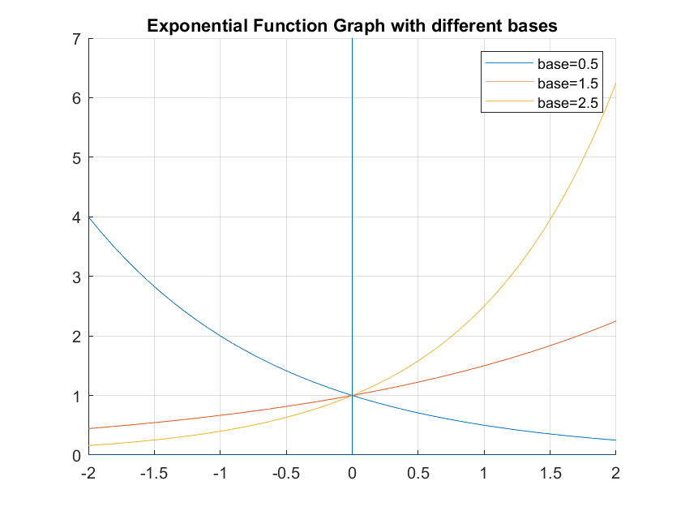
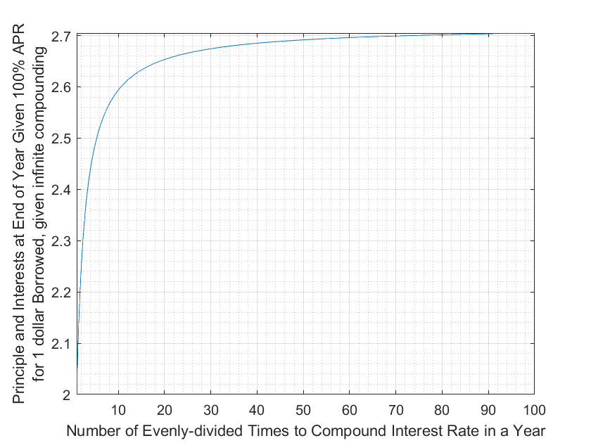
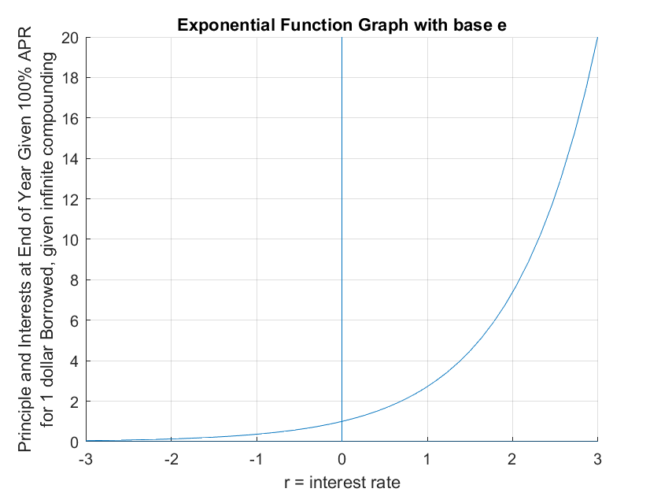

## Exponentiation and Compounding Interest Rate

```{r global_options, include = FALSE}
try(source('../.Rprofile'))
```

`r text_shared_preamble_one`
`r text_shared_preamble_two`
`r text_shared_preamble_thr`

*See also*: [Exponential Function and Log
Function](https://fanwangecon.github.io/Math4Econ/explog/exolog.html).

### **Exponential Function**

-   **Exopential Function:** Functions where the variable $x$ appears as
    an *exponent:* $a^x$

-   $a$ is the base of Exponential function.

Remember that

-   $\displaystyle a^0 =1$

-   $\displaystyle a^{\frac{1}{2}} =\sqrt{a}$

-   if $a^b =c$, we can also write, $a=c^{\frac{1}{b}}$, for example,
    $2^3 =8$, and $2=8^{\frac{1}{3}}$

-   $\displaystyle a^{-b} =\frac{1}{a^b }$

-   $\displaystyle x^a \cdot x^b =x^{a+b}$

-   $\displaystyle x^{a\cdot b} =(x^a )^b$

### Exponential Function Graphs?

-   Note that the domain of exponential function includes positive and
    negative $x$, and the exponential function will always be positive.

-   If base is below $1$, then the curve is monotonically downward
    sloping

-   If base is above $1$, then the curve is monotonically upwards
    sloping

-   If base is above $1$, higher base leads to steeper curvature.

<!-- -->

    syms x
    a1 = 0.5;
    f_a1 = a1^(x);
    a2 = 1.5;
    f_a2 = a2^(x);
    a3 = 2.5;
    f_a3 = a3^(x);
    figure();
    hold on;
    fplot(f_a1, [-2, 2]);
    fplot(f_a2, [-2, 2]);
    fplot(f_a3, [-2, 2]);
    line([0,0],ylim);
    line(xlim, [0,0]);
    title('Exponential Function Graph with different bases')
    legend(['base=',num2str(a1)], ['base=',num2str(a2)],['base=',num2str(a3)]);
    grid on;

{width=500px}

### Infinitely Compounding Interest rate

with 100 percent interest rate (APR), if we compound $N$ times within a
year, interest we pay at the end of the year is

-   $\displaystyle (1+\frac{1}{N})^N -1$

Suppose $N=5$ (You can also think of this as a loan with interest rate
of $20$% for every $73$ days), then we pay $159$% interest rate by the
end of the year.

    r = 1.05;
    N = 5;
    (1 + r/N)^N - 1

    ans = 1.5937

What if we do more and more compounding, if we say interest rate
compounds $10$, $50$, $100$ times over the year, what happens? With APR
at 100%, the total interest rate you pay at the end of the year does not
go to infinity, rather, it converges to this special number $e$, the
Exponential number, $2.7182818$, it is a magical number like $\pi$. This
means if every second the interest rate is compounding, with an APR of
100%, you end up paying 272% of what you borrowed by the end of the
year, which is 172% interest rate.

-   $\displaystyle \lim_{N\to \inf } (1+\frac{1}{N})^N =e\approx 2.7182818$

We can visualize this limit below

    r = 1;
    syms N
    f_compoundR = (1 + r/N)^N;
    figure();
    fplot(f_compoundR, [1,100])
    ylabel({'Principle and Interests at End of Year Given 100% APR' 'for 1 dollar Borrowed, given infinite compounding'})
    xlabel('Number of Evenly-divided Times to Compound Interest Rate in a Year')
    grid on;
    grid minor

{width=500px}

    double(subs(f_compoundR,[1,2,3,4,5,6,7,8,9,10]))

    ans = 1x10    
        2.0000    2.2500    2.3704    2.4414    2.4883    2.5216    2.5465    2.5658    2.5812    2.5937

### Infinitely compounding Interest rate, different $r$ (APR $r$)

Given:

-   $\displaystyle \lim_{N\to \inf } (1+\frac{1}{N})^N =e\approx 2.7182818$

What is

-   $\lim_{N\to \inf } (1+\frac{r}{N})^N$?

We can replace $N$ by $N=r\cdot M$

-   $\displaystyle \lim_{N\to \inf } (1+\frac{r}{N})^N =\lim_{M\to \inf } (1+\frac{r}{r\cdot M})^{r\cdot M} ={\left(\lim_{M\to \inf } (1+\frac{1}{M})^M \right)}^r =e^r$

This gives the base $e$ exponential function a financial interpretation.

    syms x
    f_e = exp(x);
    figure();
    hold on;
    fplot(f_e, [-3, 3]);
    line([0,0],ylim);
    line(xlim, [0,0]);
    title('Exponential Function Graph with base e')
    xlabel('r = interest rate');
    ylabel({'Principle and Interests at End of Year Given 100% APR' 'for 1 dollar Borrowed, given infinite compounding'})
    grid on;

{width=500px}
