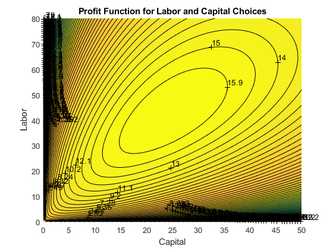

## Cobb Douglas Profit Maximization

```{r global_options, include = FALSE}
try(source('../.Rprofile'))
```

`r text_shared_preamble_one`
`r text_shared_preamble_two`
`r text_shared_preamble_thr`

In the example here, we will solve a firm optimization problem using a
system of linear equations (2 equations and 2 unknowns). The solution
method is the same for N inputs with Cobb-Douglas Production Function.

### Firm and Capital and Labor

Assume that the firm can choose capital and labor inputs. At the start
of a period, a firm rents capital inputs and combines capital with labor
to produce. At the end of the period, the firm sells its output and pays
interest rates based on how much capital it rented, and also pays wage.
Total wage bill is $L\cdot w$, interest payment is $K\cdot r$ (Here we
assume that there is no depreciation of capital, so firm can repay
principle by returning capital and just pay interest rate). Profit is
denoted by $\pi$, period interest rate is $r$, the price of output is
$p$, the firm makes $y$ units of output, and the production function is
Cobb-Douglas: $A\cdot K^{\alpha } \cdot L^{\beta }$

The profit maximization problem is:

-   $\displaystyle \max_{K,L} \left(p\cdot A\cdot K^{\alpha } \cdot L^{\beta } -r\cdot K-w\cdot L\right)$

To find optimal choices, we will assume that $\alpha +\beta <1$

### Two First Order Conditions

-   $\displaystyle \frac{\partial \Pi }{\partial K}=\alpha \cdot p\cdot A\cdot K^{\alpha -1} \cdot L^{\beta } -r$

-   $\displaystyle \frac{\partial \Pi }{\partial L}=\beta \cdot p\cdot A\cdot K^{\alpha } \cdot L^{\beta -1} -w$

*Components of profit first oder conditions*: $MPL$ and $MPK$ are always
both positive, but they are decreasing with higher $L$ and higher $K$
respectively. On the other hand, the marginal cost of capital and labor
are fixed.

-   $\displaystyle \textrm{MPK}=\alpha \cdot A\cdot K^{\alpha -1} \cdot L^{\beta }$

-   $\displaystyle \textrm{MPL}=\beta \cdot A\cdot K^{\alpha } \cdot L^{\beta -1}$

-   $\displaystyle {\textrm{MC}}_K =r$

-   $\displaystyle {\textrm{MC}}_L =w$

### Log Linearizing Optimality Conditions

To find optimal choices, set the first order conditions you obtained
above to be equal to zero.

1.  $\displaystyle \alpha \cdot p\cdot A\cdot K^{\alpha -1} \cdot L^{\beta } =r$

2.  $\displaystyle \beta \cdot p\cdot A\cdot K^{\alpha } \cdot L^{\beta -1} =w$

A generic system of 2 linear equations and 2 unknowns:

-   $\displaystyle \left\lbrack \begin{array}{cc}
    a & b\\
    d & e
    \end{array}\right\rbrack \cdot \left\lbrack \begin{array}{c}
    x_1 \\
    x_2 
    \end{array}\right\rbrack =\left\lbrack \begin{array}{cc}
    a\cdot x_1 +b\cdot x_2 \\
    d\cdot x_1 +e\cdot x_2 
    \end{array}\right\rbrack =\left\lbrack \begin{array}{c}
    o\\
    p
    \end{array}\right\rbrack$

Take log of the first order conditions (log linearize), and the two
equations above become (Now we can solve for optimal choices using
*linsolve.* Note that log linearizing works regardless of how many terms
there are in the cobb-douglas production function):

-   $\displaystyle \left\lbrack \begin{array}{cc}
    (\alpha -1) & \beta \\
    \alpha  & (\beta -1)
    \end{array}\right\rbrack \cdot \left\lbrack \begin{array}{c}
    \log (K)\\
    \log (L)
    \end{array}\right\rbrack =\left\lbrack \begin{array}{cc}
    (\alpha -1)\cdot \log (K)+\beta \cdot \log (L)\\
    \alpha \cdot \log (K)+(\beta -1)\cdot \log (L)
    \end{array}\right\rbrack =\left\lbrack \begin{array}{c}
    \log \left(\frac{r}{\alpha pA}\right)\\
    \log \left(\frac{w}{\beta pA}\right)
    \end{array}\right\rbrack$

We can by hand solve by elementary row operation (linsolve).

### Solving Linear System to find Optimal Choices

The solution to the problem, with parameter values filled in could be
obtained like this:

    clear all
    % Parameters
    w = 1;
    r = 1.05;
    p = 5;
    alpha = 0.3;
    beta = 0.5;
    A = 1.0;

    %% Matrix Form of linear system
    B = [log(r/(p*A*alpha)); log(w/(p*A*beta))];
    A = [(alpha-1), beta;alpha, beta-1];
    %% Solve linear equations, and then exponentiate
    linSolu = exp(linsolve(A, B));
    %% Solution was for log(K*) and log(L*), exponentiate to get K* and L*
    KOpti = linSolu(1)

    KOpti = 24.1049

    LOpti = linSolu(2)

    LOpti = 42.1835

### Relative Choices

For Cobb-Douglas production functions, how do optimal capital and labor
choices relate to each other?

    syms w r p alpha beta A 
    % Matrix Form of linear system, same as before
    B = [log(r/(p*A*alpha)); log(w/(p*A*beta))];
    A = [(alpha-1), beta;alpha, beta-1];
    % Solve linear equations, and then exponentiate, same as before
    % We can use the simplify command to simplify this solution, get rid of exp and log:
    linSolu = simplify(exp(linsolve(A, B)))

linSolu = $\displaystyle \left(\begin{array}{c}
{\mathrm{e}}^{\frac{\log \left(\frac{r}{A\,\alpha \,p}\right)-\beta \,\log \left(\frac{r}{A\,\alpha \,p}\right)+\beta \,\log \left(\frac{w}{A\,\beta \,p}\right)}{\alpha +\beta -1}} \\
{\mathrm{e}}^{\frac{\log \left(\frac{w}{A\,\beta \,p}\right)+\alpha \,\log \left(\frac{r}{A\,\alpha \,p}\right)-\alpha \,\log \left(\frac{w}{A\,\beta \,p}\right)}{\alpha +\beta -1}} 
\end{array}\right)$

    KOpti = linSolu(1)

KOpti =
$\displaystyle {\mathrm{e}}^{\frac{\log \left(\frac{r}{A\,\alpha \,p}\right)-\beta \,\log \left(\frac{r}{A\,\alpha \,p}\right)+\beta \,\log \left(\frac{w}{A\,\beta \,p}\right)}{\alpha +\beta -1}}$

    LOpti = linSolu(2)

LOpti =
$\displaystyle {\mathrm{e}}^{\frac{\log \left(\frac{w}{A\,\beta \,p}\right)+\alpha \,\log \left(\frac{r}{A\,\alpha \,p}\right)-\alpha \,\log \left(\frac{w}{A\,\beta \,p}\right)}{\alpha +\beta -1}}$

    KOpti/LOpti

ans =
$\displaystyle {\mathrm{e}}^{\frac{\log \left(\frac{r}{A\,\alpha \,p}\right)-\beta \,\log \left(\frac{r}{A\,\alpha \,p}\right)+\beta \,\log \left(\frac{w}{A\,\beta \,p}\right)}{\alpha +\beta -1}} \,{\mathrm{e}}^{-\frac{\log \left(\frac{w}{A\,\beta \,p}\right)+\alpha \,\log \left(\frac{r}{A\,\alpha \,p}\right)-\alpha \,\log \left(\frac{w}{A\,\beta \,p}\right)}{\alpha +\beta -1}}$

The expressions from Matlab look a little convoluted, but you will
notice a lot of similar terms inside the equation. If you try to
simplify things a little bit, you will end up with a simple fraction
below, which says the ratio of optimal capital to labor choices is not
related to $A$ and $p$, but determined by the elasticity parameters
$\alpha$ and $\beta$ as well as prices $w$ and $r$. If wage increases,
you will increase the relative demand of capital vs labor. Similarly, if
$\alpha$ is higher (each unit of capital is more productive), you will
have higher relative demand for capital vs labor as well.

-   $\displaystyle \frac{K^* (r,w,A,\alpha ,\beta ,p)}{L^* (r,w,A,\alpha ,\beta ,p)}=\frac{w}{r}\cdot \frac{\alpha }{\beta }$

### Choices as a Function of $w$ and $r$

How do we solve for demand for capital and labor as a function of
prices? We can use the code above, except replace numerical values of
$r$ and $w$ with symbols. And we can easily derive demand elasticities
of prices (which are constant for cobb-douglas production functions)

    p = 5;
    alpha = 0.3;
    beta = 0.5;
    A = 1.0;
    syms w r
    % Matrix Form of linear system, same as before
    B = [log(r/(p*A*alpha)); log(w/(p*A*beta))];
    A = [(alpha-1), beta;alpha, beta-1];
    % Solve linear equations, and then exponentiate, same as before
    % We can use the simplify command to simplify this solution, get rid of exp and log:
    linSolu = simplify(exp(linsolve(A, B)));
    % The solution we get here is in terms of fractions, let's write them out:
    KOpti = linSolu(1)

KOpti = $\displaystyle \frac{225\,\sqrt{15}}{32\,r^{5/2} \,w^{5/2} }$

    LOpti = linSolu(2)

LOpti = $\displaystyle \frac{375\,\sqrt{15}}{32\,r^{3/2} \,w^{7/2} }$

### **Own and Cross Price Elasticity**

The price of labor and capital both impact the demand for labor as well
as for capital.

The elasticity of capital demand with respect to interest rate is the
*own* price elasticity of demand, and the elasticity of demand for
capital with respect to wage is the *cross* price elasticity of demand.
Similarly the elasticity of labor demand with respect to wage is the
*own* price elasticity of demand, and the elasticity of labor demand
with respect to interest rate is the *cross* price elasticity of demand.

-   If the *own* and *cross* price elastcities are in the same
    direction, then the two inputs are complements.

That is the case here as shown below. This means that with Cobb-Douglas
production function labor and capital are complements. When the price of
labor, wage increases, the demand for both labor and capital will
decrease. If they were substitutes, when labor price increases, capital
demand would increase.

*Note* that the elasticities below are not a function of anything, just
a *constant*. This is a feature of Cobb-Douglas production function,
which has constant demand elasticities of demand of inputs with respect
to prices (also constant elasticity of output with respect to inputs).
This means that capital and labor are always completements.

*Note* also that earlier on this page, we showed that with changes in
prices, relative choice for capital and labor will shift, that does not
contradict the fact that they are complements. In another word, as wage
increases, firms demand both less capital and less labor, but the effect
is greater on labor, leading to higher share of optimal capital choice.

    % Elasticity of KOpti with respect to prices?
    elasKoptiW = simplify((diff(KOpti, w)*w)/KOpti)

elasKoptiW = $\displaystyle -\frac{5}{2}$

    % elasKoptiW = -5/2 for alpha = 0.3 and A = 1.0
    elasKoptiR = simplify((diff(KOpti, r)*r)/KOpti)

elasKoptiR = $\displaystyle -\frac{5}{2}$

    % elasKoptiR = -5/2 for alpha = 0.3 and A = 1.0
    elasLoptiW = simplify((diff(LOpti, w)*w)/LOpti)

elasLoptiW = $\displaystyle -\frac{7}{2}$

    % elasLoptiW = -7/2 for alpha = 0.3 and A = 1.0
    elasLoptiR = simplify((diff(LOpti, r)*r)/LOpti)

elasLoptiR = $\displaystyle -\frac{3}{2}$

    % elasLoptiR = -3/2 for alpha = 0.3 and A = 1.0

### Graphical Results for Optimal Choices

We can visualize the optimal choices with these codes below using mesh
plot and contour plot

    % Number of grid points (points along x and y axis)
    grid_points = 100;
    % Cobb Douglas Utility
    alpha = 0.30;
    beta = 0.5;

    % Budget
    p0 = 5; % p0 is price of output
    p1 = 1.05; % p1 is r
    p2 = 1; % p2 is wage
    maxX1 = 50; % this is max domain of capital to plot
    maxX2 = 80; % this is max domain of labor to plot
    % This generates a vector between 0 and 10 with grid_points number of points
    x1 = linspace(0,maxX1,grid_points);
    % This generates another vector between 0 and 10 with grid_points number of points
    x2 = linspace(0,maxX2,grid_points);
    % This creates all possible combinations of the x1 and x2 vectors, fills up the grid
    [x1mesh, x2mesh] = meshgrid(x1,x2);
    % Evaluate the utility function at all x1 and x2 combination points
    PI = p0*(x1mesh.^alpha).*(x2mesh.^beta) - p1.*x1mesh - p2.*x2mesh;
    % Graph "hi35ll" using mesh
    close all;
    figure();
    mesh(x1mesh,x2mesh,PI);
    % Labeling
    xlabel('Capital');
    ylabel('Labor');
    zlabel('Cobb Douglas Firm Profit');
    title('Profit Function for Labor and Capital Choices')

{width=500px}

    %% To see the results more easily, contour plot
    figure();
    hold on;
    % contour plot, 100 is how many contour lines
    contour = contourf(x1mesh, x2mesh, PI, 100);
    clabel(contour);
    % Labeling
    xlabel('Capital');
    ylabel('Labor');
    zlabel('Cobb Douglas Firm Profit');
    title('Profit Function for Labor and Capital Choices')

{width=500px}
