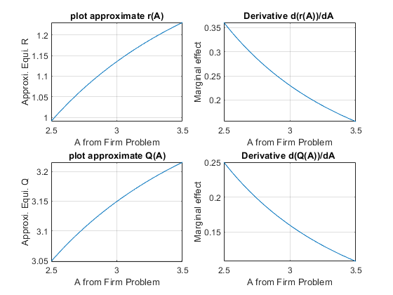
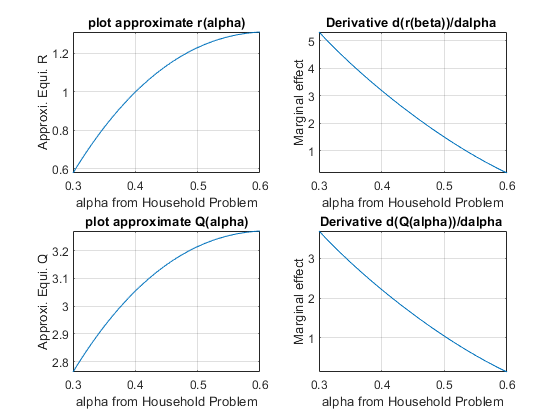

## First Order Taylor Approximation

```{r global_options, include = FALSE}
try(source('../.Rprofile'))
```

`r text_shared_preamble_one`
`r text_shared_preamble_two`
`r text_shared_preamble_thr`

### Demand and Supply for Credit and $a,b,h,k$

We derived the demand and supply for credit here: [Credit Demand and
Supply](https://fanwangecon.github.io/Math4Econ/derivative_application/K_borrow_firm.html).

The actual demand and supply equations as we derived were:

-   Supply:
    $Q_s =\frac{z\cdot \beta \cdot (1+r)-(\frac{Z}{2})}{((1+r)\cdot (1+\beta ))}$

-   Demand:
    $Q_d ={\left(\frac{r}{p\cdot A\cdot \alpha \cdot L^{0.5} }\right)}^{\frac{1}{\alpha -1}}$

We used these equations to represent supply and demand here: [First
Order Approximate Demand and
Supply](https://fanwangecon.github.io/Math4Econ/matrix_application/demand_supply_taylor_approximate.html)

-   $\displaystyle \textrm{Supply}(R)=Q_s =a-\frac{b}{(1+r)}$

-   $\displaystyle \textrm{Demand}(r)=Q_d =\frac{h}{r^k }$

### What are $a,b,h,k$?

So a general trick we use is to first simplify the equations so that we
isolate what are the parameters of the model and what are the
equilibrium variables we are solving for. In this problem, we are
solving for $Q^{equi}$ and $r^{equi}$, all other values are parameters.
In fact these two equations are exactly in the form specified here,
w`hy?`

Supply simplifies to:

-   $\displaystyle Q_s =\frac{z\beta }{1+\beta }-\frac{Z}{2\cdot (1+\beta )}\cdot \frac{1}{1+r}$

which means: $a=\frac{z\beta }{1+\beta }$, and,
$b=\frac{Z}{2\cdot (1+\beta )}$

Demand can be written as:

-   $\displaystyle Q_d ={\left(p\cdot A\cdot \alpha \cdot L^{0.5} \right)}^{\frac{1}{1-\alpha }} \cdot {\left(\frac{1}{r}\right)}^{\frac{1}{1-\alpha }}$

which means:
$h={\left(p\cdot A\cdot \alpha \cdot L^{0.5} \right)}^{\frac{1}{1-\alpha }}$,
and $k=\frac{1}{1-\alpha }$

### Exact Equlibrium Interest Rate

I copy below the parameters from [Credit Demand and
Supply](https://fanwangecon.github.io/Math4Econ/derivative_application/K_borrow_firm.html)

    clear all
    Z=10;% from household problem
    beta=0.80; % from household problem
    p=1.15; %From the question.
    L=2; %From the question.
    A=3; %You can pick a random number.
    alpha=0.45; %You can pick a random number.

Here are our actual demand supply equations typed up, we can use fzero
to find their intersection

    syms r
    % Demand Curve
    Demand = (r/(p*A*alpha*(L^0.5))).^(1/(alpha-1));
    Supply = (Z*beta*(1+r)-(Z/2))./((1+r)*(1+beta));
    % fzero to find exact intersection
    % nonlinear method, this works here and is fast, but when 
    % we have more nonlinear equations, could be very time consuming 
    % to solve, but linear approximation instantaneous to solve
    DemandMinusSupply = Demand - Supply;
    exactREqui = fzero(matlabFunction(DemandMinusSupply), 1)

    exactREqui = 1.1657

### Approximating Demand and Supply for Credit

Typing in what $k,k,a,b$ are in terms of model parameters:

    h = (p * A * alpha * L^(0.5))^(1/(1-alpha));
    k = 1/(1-alpha);
    a = (Z*beta)/(1+beta);
    b = Z/(2*(1+beta));

And now type in the matrix we derived from [First Order Approximate
Demand and
Supply](https://fanwangecon.github.io/Math4Econ/matrix_application/demand_supply_taylor_approximate.html),
approximating demand and supply around $r_0 =1$:

-   $\displaystyle \left\lbrack \begin{array}{cc}
    1 & -\frac{b}{4}\\
    1 & k\cdot h
    \end{array}\right\rbrack \cdot \left\lbrack \begin{array}{c}
    Q\\
    r
    \end{array}\right\rbrack =\left\lbrack \begin{array}{c}
    a-\frac{3}{4}b\\
    h+k\cdot h
    \end{array}\right\rbrack$

<!-- -->

    COEFMAT = [1, -b/4;1, k*h];
    OUTVEC = [a-(3*b)/4; h + k*h];
    approximateSolution = linsolve(COEFMAT, OUTVEC);
    QEquiApproximate = approximateSolution(1)

    QEquiApproximate = 3.1496

    REquiApproximate = approximateSolution(2)

    REquiApproximate = 1.1354

Given the parameters here, our linear approximation to demand and supply
gave us approximate interest rate: $1.13$, and the actual equilibrium
interest rate is $1.16$, fairly close.

### Graphical Ilustration

Let's see what is happening graphically.

FIrst parameters:

    % from household problem
    Z=10;
    beta=0.80;
    % from the firm problem
    p=1.15;
    L=2; 
    A=3; 
    alpha=0.45;

Now I type in the Taylor approximation structure again:

    syms r
    % the r0 around which we approximate
    r0 = 1;
    % Our equation from before for demand
    D = h/r^k;
    D_at_ris1 = subs(D, r, r0);
    D_diff_r_ris1 = subs(diff(D, r), r, r0);
    Demand_Approximate = D_at_ris1 + D_diff_r_ris1*(r-r0);
    % Our equation from before for supply
    S = a - b/(1+r);
    S_at_ris1 = subs(S, r, r0);
    S_diff_r_ris1 = subs(diff(S, r), r, r0);
    Supply_Approximate = S_at_ris1 + S_diff_r_ris1*(r-r0);

Now let's create a vector of interest rates, and just plot our actual
demand and supply and the approximate demand and supply together

    grid_points = 21;
    % Vector of interest rates
    rvec = linspace(1.0,1.2,grid_points);
    % Create Figure
    figure();
    hold on
    % Plot Demand and Supplies
    plot(double(subs(Demand, r, rvec)), rvec, '-b')
    plot(double(subs(Demand_Approximate, r, rvec)), rvec, '--b');
    plot(double(subs(Supply, r, rvec)), rvec, '-r')
    plot(double(subs(Supply_Approximate, r, rvec)), rvec, '--r');
    % Add in equilibrium lines
    hline = refline([0 exactREqui]);
    hline.Color = 'k';
    hline.LineStyle = '-';
    hline = refline([0 REquiApproximate]);
    hline.Color = 'k';
    hline.LineStyle = '--';
    % Legends
    xlabel('Capital Demand and Supply');
    ylabel('Interest Rate');
    title({'Inverse Demand and Supply For Capital'});
    legend({'Demand','Taylor Approxi. Demand',...
            'Supply','Taylor Approxi. Supply',...
            'Exact Equi. R', 'Approxi. Equi. R'});
    grid on

{width=500px}

### Approximate Equilibrium in terms of Parameters

One nice features of the first order taylor linear approximation is that
the solution for approximate equilibrium is analytical, so we can take
derivatives of the approximate equilibrium with respect to parameters to
analyze the effects of parameter changes on equilibrium approximately.
We have to be careful though, we should not try ranges of parameter
values too different from what we used in the example above, because
then the approximating equation derived around $r_0 =1$ might be very
bad approximations.

Remember we had these numerical values:

    % Numerical values (do not deviate too far away from these, approximate would be bad if you do)
    Z_num=10;
    beta_num=0.80;
    A_num=3; 
    alpha_num=0.45;

First, let solve for the approximate equilibrium with $A$, $\alpha$,
$\beta$, $Z$ as symbols:

    % We keep all else as numbers, but make A alpha beta Z as symbols
    syms A alpha beta Z
    % Type in our h, k, a, b again
    h = (p * A * alpha * L^(0.5))^(1/(1-alpha));
    k = 1/(1-alpha);
    a = (Z*beta)/(1+beta);
    b = Z/(2*(1+beta));
    % Coefficient Matrix
    COEFMAT = [1, -b/4;1, k*h];
    OUTVEC = [a-(3*b)/4; h + k*h];
    % Analytical solutions
    approximateSolution = linsolve(COEFMAT, OUTVEC);
    QEquiApproximate = approximateSolution(1)

QEquiApproximate =
$\displaystyle -\frac{Z\,{\left(\alpha -8\,\beta +1\right)}}{8\,\beta +Z\,{{\left(\frac{23\,\sqrt{2}\,A\,\alpha }{20}\right)}}^{\frac{1}{\alpha -1}} -Z\,\alpha \,{{\left(\frac{23\,\sqrt{2}\,A\,\alpha }{20}\right)}}^{\frac{1}{\alpha -1}} +8}$

    REquiApproximate = approximateSolution(2)

REquiApproximate = $\displaystyle \begin{array}{l}
-\frac{8\,\alpha -16\,\beta +8\,\alpha \,\beta -3\,Z\,\sigma_1 +3\,Z\,\alpha \,\sigma_1 +8\,Z\,\beta \,\sigma_1 -8\,Z\,\alpha \,\beta \,\sigma_1 -16}{8\,\beta +Z\,\sigma_1 -Z\,\alpha \,\sigma_1 +8}\\
\mathrm{}\\
\textrm{where}\\
\mathrm{}\\
\;\;\sigma_1 ={{\left(\frac{23\,\sqrt{2}\,A\,\alpha }{20}\right)}}^{\frac{1}{\alpha -1}} 
\end{array}$

So we get these complicated looing equations from matlab in terms of A,
alpha, beta and Z, we can analyze them graphically, each time fixing
three of the four syms at numerical values.

### Parameter Impacts on Equilibrium--Effects of changing $A$

How does A impact equilibrium? If A is larger, firms should demand more
capital. This holds the supply curve constant, and shifts just the
**demand curve outwards**. Interest rate in equilibrium should increase
along with equilibrium quantity:

    % We can simply use fplot to plot the results out, 
    % around a range of A values close to what we used earlier: A=3
    % we will plot below R as a function of A and also 
    REquiApproximate_A = subs(REquiApproximate, {Z, beta, alpha}, {Z_num, beta_num, alpha_num});
    QEquiApproximate_A = subs(QEquiApproximate, {Z, beta, alpha}, {Z_num, beta_num, alpha_num});
    figure();
    subplot(2,2,1);
    fplot(REquiApproximate_A, [2.5, 3.5])
    xlabel('A from Firm Problem');
    ylabel('Approxi. Equi. R');
    title('plot approximate r(A)')
    grid on
    subplot(2,2,2);
    fplot(diff(REquiApproximate_A, A), [2.5, 3.5])
    xlabel('A from Firm Problem');
    ylabel('Marginal effect');
    title('Derivative d(r(A))/dA ')
    grid on
    subplot(2,2,3);
    fplot(QEquiApproximate_A, [2.5, 3.5])
    xlabel('A from Firm Problem');
    ylabel('Approxi. Equi. Q');
    title('plot approximate Q(A)')
    grid on
    subplot(2,2,4);
    fplot(diff(QEquiApproximate_A, A), [2.5, 3.5])
    xlabel('A from Firm Problem');
    ylabel('Marginal effect');
    title('Derivative d(Q(A))/dA ')
    grid on

{width=500px}

### Parameter Impacts on Equilibrium--Effects of changing $Z$

How does $Z$ impact equilibrium? If $Z$ is larger, households' resource
difference between today and tomorrow increases (the ratio is the same
1/2, but difference is increasing), they should want to save more. This
holds demand constant, and **shifts supply out**. So there should be
higher equilibrium quantity, and lower equilibrium $r$.

    % We can simply use fplot to plot the results out, 
    REquiApproximate_Z = subs(REquiApproximate, {A, beta, alpha}, {A_num, beta_num, alpha_num});
    QEquiApproximate_Z = subs(QEquiApproximate, {A, beta, alpha}, {A_num, beta_num, alpha_num});
    figure();
    subplot(2,2,1);
    fplot(REquiApproximate_Z, [1 30])
    xlabel('Z from Household Problem');
    ylabel('Approxi. Equi. R');
    title('plot approximate r(Z)')
    grid on
    subplot(2,2,2);
    fplot(diff(REquiApproximate_Z, Z), [1 30])
    xlabel('Z from Household Problem');
    ylabel('Marginal effect');
    title('Derivative d(r(Z))/dZ ')
    grid on
    subplot(2,2,3);
    fplot(QEquiApproximate_Z, [1 30])
    xlabel('Z from Household Problem');
    ylabel('Approxi. Equi. Q');
    title('plot approximate Q(Z)')
    grid on
    subplot(2,2,4);
    fplot(diff(QEquiApproximate_Z, Z), [1 30])
    xlabel('Z from Household Problem');
    ylabel('Marginal effect');
    title('Derivative d(Q(Z))/dZ ')
    grid on

{width=500px}

### Parameter Impacts on Equilibrium--Effects of changing $\beta$

How does $\beta$ impact equilibrium? If $\beta$ is larger, households
like the future more, and should want to save more as well. This holds
demand constant, and shifts supply out. So there should be higher
equilibrium quantity, and lower equilibrium $r$.

    % We can simply use fplot to plot the results out, 
    REquiApproximate_beta = subs(REquiApproximate, {A, Z, alpha}, {A_num, Z_num, alpha_num});
    QEquiApproximate_beta = subs(QEquiApproximate, {A, Z, alpha}, {A_num, Z_num, alpha_num});
    figure();
    subplot(2,2,1);
    fplot(REquiApproximate_beta, [0.75, 0.99])
    xlabel('beta from Household Problem');
    ylabel('Approxi. Equi. R');
    title('plot approximate r(beta)')
    grid on
    subplot(2,2,2);
    fplot(diff(REquiApproximate_beta, beta), [0.75, 0.99])
    xlabel('beta from Household Problem');
    ylabel('Marginal effect');
    title('Derivative d(r(beta))/dbeta ')
    grid on
    subplot(2,2,3);
    fplot(QEquiApproximate_beta, [0.75, 0.99])
    xlabel('beta from Household Problem');
    ylabel('Approxi. Equi. Q');
    title('plot approximate Q(beta)')
    grid on
    subplot(2,2,4);
    fplot(diff(QEquiApproximate_beta, beta), [0.75, 0.99])
    xlabel('beta from Household Problem');
    ylabel('Marginal effect');
    title('Derivative d(Q(beta))/dbeta ')
    grid on

{width=500px}

### Parameter Impacts on Equilibrium--Effects of changing $\alpha$

How does $\alpha$ impact equilibrium? If $\alpha$ is larger, the
elasticity of output with respect to capital is greater, holding price
fixed, do firms increase demand or decrease? For these range of
approximating values below, they increase demand

    % We can simply use fplot to plot the results out, 
    REquiApproximate_alpha = subs(REquiApproximate, {A, Z, beta}, {A_num, Z_num, beta_num});
    QEquiApproximate_alpha = subs(QEquiApproximate, {A, Z, beta}, {A_num, Z_num, beta_num});
    figure();
    subplot(2,2,1);
    fplot(REquiApproximate_alpha, [0.30, 0.60])
    xlabel('alpha from Household Problem');
    ylabel('Approxi. Equi. R');
    title('plot approximate r(alpha)')
    grid on
    subplot(2,2,2);
    fplot(diff(REquiApproximate_alpha, alpha), [0.30, 0.60])
    xlabel('alpha from Household Problem');
    ylabel('Marginal effect');
    title('Derivative d(r(beta))/dalpha ')
    grid on
    subplot(2,2,3);
    fplot(QEquiApproximate_alpha, [0.30, 0.60])
    xlabel('alpha from Household Problem');
    ylabel('Approxi. Equi. Q');
    title('plot approximate Q(alpha)')
    grid on
    subplot(2,2,4);
    fplot(diff(QEquiApproximate_alpha, alpha), [0.30, 0.60])
    xlabel('alpha from Household Problem');
    ylabel('Marginal effect');
    title('Derivative d(Q(alpha))/dalpha ')
    grid on

{width=500px}
