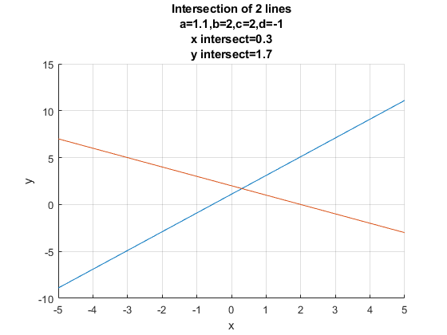

## Solving for Two Equations and Two Unknowns

```{r global_options, include = FALSE}
try(source('../.Rprofile'))
```

`r text_shared_preamble_one`
`r text_shared_preamble_two`
`r text_shared_preamble_thr`

*See also*: [System of Linear
Equations](https://fanwangecon.github.io/Math4Econ/matrix_system_of_equations/matrix_linear_equations.html)

*See also*: [Solving for Two Equations and Two
Unknowns](https://fanwangecon.github.io/Math4Econ/matrix_system_of_equations/matrix_linear_system_2.html)

*See also*: [System of Linear Equations, Row Echelon
Form](https://fanwangecon.github.io/Math4Econ/matrix_system_of_equations/matrix_row_echelon_form.html)

### Intersection of two Linear Equations

We have two line:

$$\left\lbrace \begin{array}{c}
y=a+b\cdot x\\
y=c+d\cdot x
\end{array}\right.$$

Where do these lines intersect? Visually, given some values for
$a,b,c,d$:

    % Symbol
    syms x 
    % Parameters
    a = 1.1;
    b = 2;
    c = 2;
    d = -1;
    % Define Equations
    y1 = a + b*x

y1 = $\displaystyle 2\,x+\frac{11}{10}$

    y2 = c + d*x

y2 = $\displaystyle 2-x$

    % Solve for analytical solutions using symbolic toolbox
    solve_analytical_x = double(solve(y1 - y2 == 0));
    solve_analytical_y = double(subs(y1, solve_analytical_x));
    % Plot Figure
    figure();
    hold;

    Current plot held

    fplot(y1)
    fplot(y2)
    % Labeling
    ylabel('y')
    xlabel('x')
    grid on;
    title({'Intersection of 2 lines'...
          ,['a=' num2str(a)...
            ',b=' num2str(b)...
            ',c=' num2str(c)...
            ',d=' num2str(d)]...
           ,['x intersect=',num2str(solve_analytical_x)]...
           ,['y intersect=',num2str(solve_analytical_y)]});

{width=500px}

### Linear Equation in Matrix Form

Sometimes we can write down our problem as a set of linear equations. A
linear equation is an equation where the unknown variables are
multiplied by a set of known constants and then added up to a known
constant:

-   for example: $-2\cdot x+\cdot y=1$, has two unknowns.

Using matrix algebra, we can express the above equation in matrix form:

-   $\displaystyle \left\lbrack \begin{array}{cc}
    -2 & 1
    \end{array}\right\rbrack \cdot \left\lbrack \begin{array}{c}
    x\\
    y
    \end{array}\right\rbrack =-2\cdot x+1\cdot y=1$

### Two Linear Equation in Matrix Form

We have two equations above, we can write both of them using the matrix
form, given:

-   $\displaystyle \left\lbrace \begin{array}{c}
    y=a+b\cdot x\\
    y=c+d\cdot x
    \end{array}\right.$

We can re-write these as:

-   $\displaystyle \left\lbrack \begin{array}{cc}
    1 & -b\\
    1 & -d
    \end{array}\right\rbrack \cdot \left\lbrack \begin{array}{c}
    y\\
    x
    \end{array}\right\rbrack =\left\lbrack \begin{array}{cc}
    1\cdot y-b\cdot x\\
    1\cdot y-d\cdot x
    \end{array}\right\rbrack =\left\lbrack \begin{array}{c}
    a\\
    c
    \end{array}\right\rbrack$

We can define these following matrixes to simplify notations:

-   $\displaystyle W=\left\lbrack \begin{array}{cc}
    1 & -b\\
    1 & -d
    \end{array}\right\rbrack$

-   ${X}=\left\lbrack \begin{array}{c}
    x\\
    y
    \end{array}\right\rbrack$, note the use of bold letter to represent
    a vector of unknowns, we could have called small $x$ and $y$, $x_1$
    and $x_2$.

-   $\displaystyle v=\left\lbrack \begin{array}{c}
    a\\
    c
    \end{array}\right\rbrack$

And the linear system of equations is:

-   $\displaystyle W\cdot {X}=v$

### Linsolve: Matlab Matrix Solution for 2 Equations and Two Unknowns 

Once you have transformed a system of equations, you can use matlab's
linsolve function to solve for the unknowns. As long as the two lines
are not parallel to each other, you will be able to find solutions:

    W = [1, -b;1, -d]

    W = 2x2    
         1    -2
         1     1

    v = [a; c]

    v = 2x1    
        1.1000
        2.0000

    solution = linsolve(W,v)

    solution = 2x1    
        1.7000
        0.3000

    yIntersection = solution(1,1)

    yIntersection = 1.7000

    xIntersection = solution(2,1)

    xIntersection = 0.3000

The solution here should match the number in title of the graph plotted
earlier.

When you do not have matlab, you can solve for the optimal choices using
a combination of elementary row operations.

*Note*: If we used elementary row operations, and arrived at the reduced
row echelon form, the analytical solution would be (and this is what
linsolve is doing):

    % Analytical Results using elementary row operations
    yIntersectionEro = a + b*(c-a)/(b-d)

    yIntersectionEro = 1.7000

    xIntersectionEro = (c-a)/(b-d)

    xIntersectionEro = 0.3000
