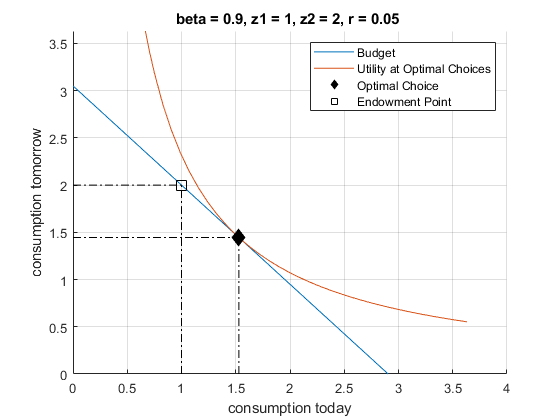

## Intertemporal Expenditure Minimization

```{r global_options, include = FALSE}
try(source('../.Rprofile'))
```

`r text_shared_preamble_one`
`r text_shared_preamble_two`
`r text_shared_preamble_thr`

We previously solved for the unconstrained household's savings and
borrowing problem: [unconstrained
problem](https://fanwangecon.github.io/Math4Econ/derivative_application/K_save_households.html).
And also the [constrained
optimization](https://fanwangecon.github.io/Math4Econ/opti_hh_constrained_brsv/household_borrow_constrained.html)
problem with asset choice.

### Utility Maximization over Consumption in Two Periods

We solved the [constrained utility maximization
probem](https://fanwangecon.github.io/Math4Econ/opti_hh_constrained_brsv/household_c1_c2_constrained.html)
already.

-   **Utility**: $U(c_1 ,c_2 )=\log (c_1 )+\beta \cdot \log (c_2 )$

-   **Budget Today and Tomorrow Together**:
    $c_1 \cdot (1+r)+c_2 =Z_1 \cdot (1+r)+Z_2$

We found the indirect utility given optimal choices:

    clear all
    % previous solution, indirect uitlity
    U_at_c_opti = 0.75563;
    c1_opti = 1.5288;
    c2_opti = 1.4447;
    % parameters
    beta = 0.90;
    z1 = 1;
    z2 = 2;
    r = 0.05;

### The Expenditure Minimization Problem

We can represent the budget constraint and utility function (objective
function) graphically. When we plug the optimal choices back into the
utility function, we have the ***indirect utility***.

-   **Indirect Utility function**:
    $V(c_1^* (r,Z_1 ,Z_2 ),c_2^* (r,Z_1 ,Z_2 ))=V(r,Z_1 ,Z_2 )$

Note that the indirect utility is a function of the price $r$ that
households face, and the resources the have available--their
income--$Z_1 ,Z_2$. We can also write:

-   $\displaystyle V(r,Z_1 ,Z_2 )=\max_{c_1 ,c_2 } U(c_1 ,c_2 ;r,Z_1 ,Z_2 )$

Similar to the firm's profit maximization and [cost minimization
problems](https://fanwangecon.github.io/Math4Econ/opti_firm_constrained/profit_maximize.html),
which gave us similar optimality conditions, we can solve the
household's expenditure minimization problem given $V^*$, and the
optimal choices will be the same choices that gave us $V^*$ initially.
Specifically:

$$\min_{c1,c2} \left(c_2 +(1+r)c_1 \right)$$

-   such that:

$$\log (c_1 )+\beta \log (c_2 )=V^{\ast } (r,Z_1 ,Z_2 )$$

### First Order Conditions of the Constrained Consumption Problem

Note again we already know the solution of this problem from:
[unconstrained
problem](https://fanwangecon.github.io/Math4Econ/derivative_application/K_save_households.html).
What we are doing here is to resolve the problem, but now directly for
$c_1$ and $c_2$, rather than $b$. But the results are the same because
once you know $b$ you know the consumption choices from the budget, and
vice-versa. The solution method here is more complicated because we went
from an one-choice problem in [unconstrained
problem](https://fanwangecon.github.io/Math4Econ/derivative_application/K_save_households.html)
to a three choice problem below. But the solution here is more general,
allowing us to have addition constraints that can not be easily plugged
directly into the utility function.

To solve the problem, we write down the Lagrangian, and solve a problem
with three choices.

-   $\displaystyle \mathcal{L}=c_2 +(1+r)c_1 -\mu \left(\log (c_1 )+\beta \log (c_2 )-V^* (r)\right)$

We have three partial derivatives of the lagrangian, and at the optimal
choices, these are true:

-   $\frac{\partial \mathcal{L}}{\partial c_1 }=0$, then,
    $\frac{\mu }{c_1^{\ast } }=(1+r)$

-   $\frac{\partial \mathcal{L}}{\partial c_2 }=0$, then,
    $\frac{\beta \cdot \mu }{c_2^{\ast } }=1$

-   $\frac{\partial \mathcal{L}}{\partial \mu }=0$, then,
    $\log (c_1^{\ast } )+\beta \log (c_2^{\ast } )=V^{\ast } (r,Z_1 ,Z_2 )$

### Optimal Relative Allocations of Consumptions in the First and Second Periods

Bringing the firs two conditions together, we have:

-   $\displaystyle \frac{\beta }{c_2^{\ast } }=\frac{1}{c_1^{\ast } \cdot (1+r)}$

-   $\displaystyle \frac{c_1^{\ast } }{c_2^{\ast } }=\frac{1}{\beta \cdot (1+r)}$

-   $\displaystyle c_1^{\ast } =\frac{1}{\beta \cdot (1+r)}\cdot c_2^{\ast }$

This is the same as for the constrained utility maximization problem:
[constrained utility maximization
probem](https://fanwangecon.github.io/Math4Econ/opti_hh_constrained_brsv/household_c1_c2_constrained.html).

### Optimal Expenditure Minimization Consumption Choices

Using the third first order condition, and the optimal consumption
ratio, we have:

-   $\displaystyle \log (\frac{1}{\beta \cdot (1+r)}\cdot c_2^{\ast } )+\beta \log (c_2^{\ast } )=V^{\ast } (r,Z_1 ,Z_2 )$

-   $\displaystyle c_2^{\ast } =\exp \left(\left(V^{\ast } (r,Z_1 ,Z_2 )+\log (\beta \cdot (1+r))\right)\cdot \frac{1}{1+\beta }\right)$

Subsequently, we can obtain optimal expenditure minimization $c_1$ and
$b$.

The solutions here are **Hicksian**, these are the dual version of the
Marshallian problem from: [constrained utility maximization
probem](https://fanwangecon.github.io/Math4Econ/opti_hh_constrained_brsv/household_c1_c2_constrained.html)

### Compuational Solution

Solving the problem with the same parameters as before given $V^*$, we
will get the same solutions that we got above:

    syms c1 c2 lambda
    % The Lagrangian given U_at_c_opti found earlier
    lagrangian = (c2 + (1+r)*c1 - lambda*( log(c1) + beta*log(c2) - U_at_c_opti));
    % Derivatives
    d_lagrangian_c1 = diff(lagrangian, c1);
    d_lagrangian_c2 = diff(lagrangian, c2);
    d_lagrangian_mu = diff(lagrangian, lambda);
    GRADIENTmin = [d_lagrangian_c1; d_lagrangian_c2; d_lagrangian_mu]

GRADIENTmin = $\displaystyle \left(\begin{array}{c}
\frac{21}{20}-\frac{\lambda }{c_1 }\\
1-\frac{9\,\lambda }{10\,c_2 }\\
\frac{75563}{100000}-\frac{9\,\log \left(c_2 \right)}{10}-\log \left(c_1 \right)
\end{array}\right)$

    solu_min = solve(GRADIENTmin(1)==0, GRADIENTmin(2)==0, GRADIENTmin(3)==0, c1, c2, lambda, 'Real', true);
    soluMinC1 = double(solu_min.c1);
    soluMinC2 = double(solu_min.c2);
    soluMinLambda = double(solu_min.lambda);
    disp(table(soluMinC1, soluMinC2, soluMinLambda));

        soluMinC1    soluMinC2    soluMinLambda
        _________    _________    _____________

         1.5288       1.4447         1.6053    

### Graphical Representation

At a particular $r,Z_1 ,Z_2$, we have a specific numerical value for
$V^*$. We have different bundles of $c_1 ,c_2$ that can all achieve this
particular utility level $V^*$. We can draw these and see visually where
the optimal choices are. So we have two equations that we can draw:

-   Budget: $(1)c_2 +(1+r)c_1 \le Z_1 (1+r)+Z_2$

-   Indifference at $V^*$: $V^* =\log (c_1 )+\beta \log (c_2 )$, which
    is: $c_2 =\exp \left(\frac{V^* -\log (c_1 )}{\beta }\right)$

Think of $c_1$ as the x-axis variable, and $c_2$ as the y-axis variable,
we can plot them together

    % Numbers defined before, and U_at_c_opti found before
    syms c1
    % The Budget Line
    f_budget = z1*(1+r) + z2 - (1+r)*c1;
    % Indifference at V*
    f_indiff = exp((U_at_c_opti-log(c1))/(beta));
    % Graph
    figure();
    hold on;
    % Main Lines
    fplot(f_budget, [0, (z1 + z2/(1+r))*1.25]);
    fplot(f_indiff, [0, (z1 + z2/(1+r))*1.25]);
    % Endowment Point
    scatter(c1_opti, c2_opti, 100, 'k', 'filled', 'd');
    plot(linspace(0,c1_opti,10),ones(10,1) * c2_opti, 'k-.', 'HandleVisibility','off');
    plot(ones(10,1) * c1_opti, linspace(0,c2_opti,10), 'k-.', 'HandleVisibility','off');
    % Optimal Choices Point
    scatter(z1, z2, 100, 'k', 's');
    plot(linspace(0,z1,10),ones(10,1) * z2, 'k-.', 'HandleVisibility','off');
    plot(ones(10,1) * z1, linspace(0,z2,10), 'k-.', 'HandleVisibility','off');
    % Labeling
    ylim([0, (z1 + z2/(1+r))*1.25])
    title(['beta = ' num2str(beta) ', z1 = ' num2str(z1) ', z2 = ' num2str(z2) ', r = ' num2str(r) ' '])
    xlabel('consumption today');
    ylabel('consumption tomorrow');
    legend({'Budget', 'Utility at Optimal Choices', 'Optimal Choice', 'Endowment Point'})
    grid on;

{width=500px}
