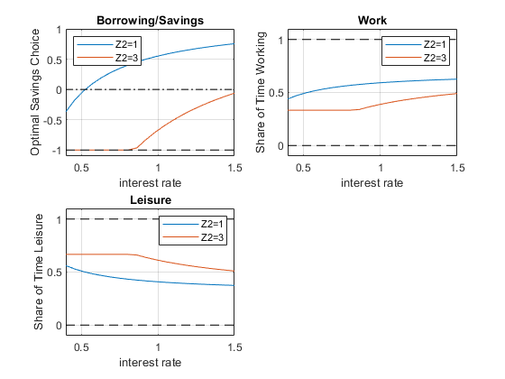

## Leisure, Savings and Constrained Borrowing

```{r global_options, include = FALSE}
try(source('../.Rprofile'))
```

`r text_shared_preamble_one`
`r text_shared_preamble_two`
`r text_shared_preamble_thr`

We previously solved for the unconstrained household's savings and
borrowing problem: [unconstrained
problem](https://fanwangecon.github.io/Math4Econ/derivative_application/K_save_households.html).
And we previously solved for the constrained savings and borrowing
problem for the household without labor: [Constrained Household
Borrowing](https://fanwangecon.github.io/Math4Econ/opti_hh_constrained_brsv/household_borrow_constrained.html).

### What is the constrained asset choice problem with labor?

We have endowments in two periods, $Z_1$ and $Z_2$. Households can
choose to work or have leisure. Think about the first period as the
young period, the second period as the old period (retirement). Your
wage in the first period could be used for first period consumption or
saved for consumption in retirement.

-   **Utility**:
    $U(c_{today} ,c_{tomrrow} )=\log (c_{today} )+\psi \log (\textrm{leisure})+\beta \cdot \log (c_{tomorrow} )$

-   **Budget Today**: $c_{today} +b=Z_1 +w\cdot \textrm{work}$

-   **Budget Tomorrow**: $c_{tomorrow} =b\cdot (1+r)+Z_2$

$w$ is the wage, and $b$ can be positive or negative.

### Single Inequality Constraint Problem

We can formulate the constrained problem as this:

-   specifically:

$$\max_{b,\textrm{work}} \log (Z_1 +w\cdot \textrm{work}-b)+\psi \log (\textrm{T}\textrm{-}\textrm{work})+\beta \cdot \log (Z_2 +b\cdot (1+r))$$

And the constraints is:

$$b\ge \bar{b}$$

We plugged $b$ into the utility function, so that we do not have to
choose $c_1$ and $c_2$ explicitly. We also replaced leisure by $T-work$
in the utility. Additionally leisure will always be positive due to log
utility. We have an utility maximization problem with a single
inequality constraint, which is that the household can not borrow more
than $\bar{b}$. Then, we would solve for the unconstrained optimal work
and $b$ choices, if the optimal unconstrained $b$ choice is larger than
$\bar{b}$, then we are done, otherwise, we solve for the optimal work
choice given $b=\bar{b}$.

$$b^{\textrm{con}} =\left\lbrace \begin{array}{c}
b^{\textrm{unc}} \textrm{,}\;\textrm{if}\;b^{\textrm{unc}} >\bar{b} \\
\bar{b} \textrm{,}\;\textrm{otherwise}
\end{array}\right.$$

$${\textrm{work}}^{\textrm{con}} =\left\lbrace \begin{array}{c}
{\textrm{work}}^{\textrm{unc}} \textrm{,}\;\textrm{if}\;b^{\textrm{unc}} <\bar{b} \\
\arg \max_{\textrm{work}} U\left(\bar{b} ,\textrm{work};r,w\right)\textrm{,}\;\textrm{otherwise}
\end{array}\right.$$

In the sections below, we:

-   solve analytically the unconstrained optimal choices by hand and
    using the symbolic toolbox

-   solve the optimal work time choice given binding borrowing
    constraint

-   solve numerically directly for the constrained optimal choices

### Unconstrained Optimal Labor and Borrowing and Savings Choices Prlbme

To solve the problem, we write down the Lagrangian, and solve a problem
with three choices, and let us use $H=\textrm{work}$ to represent work
time:

-   $\displaystyle \mathcal{L}=\log (Z_1 +w\cdot H-b)+\psi \log (\textrm{T}\textrm{-}\textrm{H})+\beta \cdot \log (Z_2 +b\cdot (1+r))$

We have two partial derivatives of the lagrangian, and at the optimal
choices, these are true:

-   $\frac{\partial \mathcal{L}}{\partial b}=0$, then,
    $\frac{1}{Z_1 +w\cdot H-b}=\frac{\beta \cdot (1+r)}{Z_2 +b\cdot (1+r)}$

-   $\frac{\partial \mathcal{L}}{\partial H}=0$, then,
    $\frac{w}{Z_1 +w\cdot H-b}=\frac{\psi }{T-H}$

**Unconstrained Choices--One Equation and One Unknown**

We have two equations and two unknowns, from the two FOCs above, we
have:

1.  $\displaystyle \frac{\beta \cdot (1+r)}{Z_2 +b\cdot (1+r)}=\frac{\psi }{w\cdot \left(T-H\right)}$

2.  $\displaystyle H=T-\frac{Z_2 +b\cdot (1+r)}{\beta \cdot (1+r)}\cdot \frac{\psi }{w}$

Then pluggint this back in to the first FOC, we have:

1.  $\displaystyle \frac{1}{Z_1 +w\cdot \left(T-\frac{Z_2 +b\cdot (1+r)}{\beta \cdot (1+r)}\cdot \frac{\psi }{w}\right)-b}=\frac{\beta \cdot (1+r)}{Z_2 +b\cdot (1+r)}$

2.  $\displaystyle \frac{1}{Z_1 +wT-\frac{\psi }{\beta (1+r)}Z_2 -\left(1+\frac{\psi }{\beta }\right)b}=\frac{\beta (1+r)}{Z_2 +b(1+r)}$

This is one equation and one unknown.

**Unconstrained Choices--Analytical Optimal Borrowing and Savings
Choice**

We use $\Omega$ and $\chi$ to replace some terms above, and have:

1.  $\displaystyle \frac{1}{\Omega -\chi b}=\frac{\beta }{Z_2 \frac{1}{1+r}+b}$

2.  $\displaystyle Z_2 \frac{1}{1+r}+b=\Omega \beta -\chi \beta b$

3.  $\displaystyle b^{\ast } =\frac{\Omega \beta -\frac{1}{1+r}Z_2 }{1+\chi \beta }$

Above we have the optimal borrowing and savings choice solution, to
better interpret it, we plug $\Omega$ and $\chi$ back in

1.  $\displaystyle b^{\ast } =\frac{\left(Z_1 +wT-\frac{\psi }{\beta (1+r)}Z_2 \right)\beta -\frac{1}{1+r}Z_2 }{1+\left(1+\frac{\psi }{\beta }\right)\beta }$

2.  $\displaystyle b^{\ast } =\frac{\left(Z_1 (1+r)+wT(1+r)-\frac{\psi }{\beta }Z_2 \right)\beta -Z_2 }{\left(1+r\right)\left(1+\beta +\psi \right)}$

3.  $\displaystyle b^{\ast } =\frac{\left(Z_1 +wT\right)\beta (1+r)-\left(1+\psi \right)Z_2 }{\left(1+r\right)\left(1+\beta +\psi \right)}$

4.  $\displaystyle b^{\ast } =\frac{\left(Z_1 +wT\right)\beta -\frac{1+\psi }{1+r}Z_2 }{1+\beta +\psi }$

Our optimal borrowing and savings choice is:

$$b^{\ast ,unc} =\frac{\left(Z_1 +wT\right)\beta -\frac{1+\psi }{1+r}Z_2 }{1+\beta +\psi }$$

$${\textrm{work}}^{\ast ,unc} ={\textrm{H}}^{\ast ,unc} =T-\frac{Z_2 +b^{\ast ,unc} \cdot (1+r)}{\beta \cdot (1+r)}\cdot \frac{\psi }{w}$$

The solution here is very similar to the solution we derived for the
[borrowing and savings problem
earlier](https://fanwangecon.github.io/Math4Econ/optimization_application/household_c1_c2_constrained.html).
Note that the key difference here is that wage and total time:
$w\cdot T$ are simply increasing today's endowment. When the individual
prefers leisure more, the individual is more likely to borrow. We have
just solved for the unconstrained optimal choices

**Unconstrained Choices--Matlab Analytical Symbolic Solutions**

Matlab can solve the optimal choices for us. We can use diff and solve,
the solution below is identical to the solution we derived on top.

    syms r z1 z2 w head b T H beta psi
    % The Lagrangian
    lagrangian = (log(z1 + w*H- b) + psi*log(T-H) + beta*log(z2 + b*(1+r)))

lagrangian =
$\displaystyle \log \left(z_1 -b+H\,w\right)+\psi \,\log \left(T-H\right)+\beta \,\log \left(z_2 +b\,{\left(r+1\right)}\right)$

    % Derivatives
    d_lagrangian_b = diff(lagrangian, b);
    d_lagrangian_H = diff(lagrangian, H);
    GRADIENTmax = [d_lagrangian_b; d_lagrangian_H]

GRADIENTmax = $\displaystyle \left(\begin{array}{c}
\frac{\beta \,{\left(r+1\right)}}{z_2 +b\,{\left(r+1\right)}}-\frac{1}{z_1 -b+H\,w}\\
\frac{\psi }{H-T}+\frac{w}{z_1 -b+H\,w}
\end{array}\right)$

    % Given we have many symbols, type K, L, mu at the end to let matlab know what we are solving for
    solu = solve(GRADIENTmax(1)==0, GRADIENTmax(2)==0, b, H, 'Real', true);
    solub = simplify(solu.b)

solub =
$\displaystyle \frac{\beta \,z_1 -z_2 -\psi \,z_2 +T\,\beta \,w+\beta \,r\,z_1 +T\,\beta \,r\,w}{{\left(r+1\right)}\,{\left(\beta +\psi +1\right)}}$

    soluH = (solu.H)

soluH =
$\displaystyle \frac{T\,w-\psi \,z_1 -\psi \,z_2 +T\,\beta \,w+T\,r\,w-\psi \,r\,z_1 +T\,\beta \,r\,w}{w+\beta \,w+\psi \,w+r\,w+\beta \,r\,w+\psi \,r\,w}$

**Work Choice given Binding Borrowing Constraint--Matlab Analytical
Symbolic Solutions**

Now we solve, if the household's borrowing choice is constrained, that
is the borrowing constraint binds, then the household optimizes work
time choice given $b=\bar{b}$.

    syms r z1 z2 w head bbar T H beta psi
    % The Lagrangian
    lagrangian = (log(z1 + w*H- bbar) + psi*log(T-H) + beta*log(z2 + bbar*(1+r)))

lagrangian =
$\displaystyle \log \left(z_1 -\textrm{bbar}+H\,w\right)+\psi \,\log \left(T-H\right)+\beta \,\log \left(z_2 +\textrm{bbar}\,{\left(r+1\right)}\right)$

    % Derivatives
    d_lagrangian_H = diff(lagrangian, H);
    GRADIENTmax = [d_lagrangian_H]

GRADIENTmax =
$\displaystyle \frac{\psi }{H-T}+\frac{w}{z_1 -\textrm{bbar}+H\,w}$

    % Given we have many symbols, type K, L, mu at the end to let matlab know what we are solving for
    solu = solve(GRADIENTmax(1)==0, H, 'Real', true);
    solu

solu =
$\displaystyle \frac{T\,w+\textrm{bbar}\,\psi -\psi \,z_1 }{w+\psi \,w}$

### Numerical Solution to the Inequality Constraint Problem

We can formulate the constrained problem as this:

-   specifically:
    $\max_{b,\textrm{work},\textrm{leisure}} \log (Z_1 +w\cdot \textrm{work}-b)+\psi \log (\textrm{leisure})+\beta \cdot \log (Z_2 +b\cdot (1+r))$

And the constraints are:

1.  $\displaystyle b\ge \bar{b}$

2.  $\displaystyle \textrm{work}\ge 0$

3.  $\displaystyle \textrm{leisure}\ge 0$

4.  $\textrm{work}+\textrm{leisure}\le T$, where $T$ is total time
    available

We plugged $b$ into the utility function, so that we do not have to
choose $c_1$ and $c_2$ explicitly. We could also replace leisure by
$T-work$ in the utility. Additionally leisure will always be positive
due to log utility. If we did that, we have an utility maximization
problem with a single inequality constraint, which is that the household
can not borrow more than $\bar{b}$. Then, we would solve for the
unconstrained optimal work and $b$ choices, if the optimal unconstrained
$b$ choice is larger than $\bar{b}$, then we are done

**Formulating the Constraints as a System of Linear Equations**

Matlab has a conveninent function that solves any constrained
maximization problem, ***fmincon***, we used it for one choice and one
constraint before:[Constrained Household
Borrowing](https://fanwangecon.github.io/Math4Econ/optimization_application/household_borrow_constrained.html).
Now we have four constraints and three choice variables, we write them
all as less than or equal to:

1.  $\displaystyle \bar{b} -b\le 0$

2.  $\displaystyle -\textrm{work}\le 0$

3.  $\displaystyle -\textrm{leisure}\le 0$

4.  $\displaystyle \textrm{work}+\textrm{leisure}\le T$

This is actually a linear system, the equations above are equal to:

1.  $\displaystyle (-1)\cdot b+0\cdot \textrm{work}+0\cdot \textrm{leisure}\le -\bar{b}$

2.  $\displaystyle 0\cdot b+(-1)\cdot \textrm{work}+0\cdot \textrm{leisure}\le 0$

3.  $\displaystyle 0\cdot b+0\cdot \textrm{work}+(-1)\cdot \textrm{leisure}\le 0$

4.  $\displaystyle 0\cdot b+1\cdot \textrm{work}+1\cdot \textrm{leisure}\le T$

Which mean that we have a $A$ matrix and $q$ vector:

-   $\displaystyle \left\lbrack \begin{array}{ccc}
    -1 & 0 & 0\\
    0 & -1 & 0\\
    0 & 0 & -1\\
    0 & 1 & 1
    \end{array}\right\rbrack \cdot \left\lbrack \begin{array}{c}
    b\\
    \textrm{work}\\
    \textrm{leisure}
    \end{array}\right\rbrack \le \left\lbrack \begin{array}{c}
    -\bar{b} \\
    0\\
    0\\
    T
    \end{array}\right\rbrack$

<!-- -->

    clear all
    % Parameters
    beta = 0.95;
    psi = 0.5;
    z1 = 1;
    z2 = 2;
    r = 1.05;
    b_bar_num = -1; % borrow up to 1 dollar 
    w = 2; % wage rate
    T = 1; % think about time as share of time in a year
    % Write down the objective function, we will define it as a function handle, negative utility for minimization
    U_neg = @(x) -1*(log(z1 + w*x(2) - x(1)) + psi*log(x(3)) + beta*log(z2 + x(1)*(1+r)));
    % Constraint dervied above
    A = [-1,0,0;0,0,-1;0,-1,0;0,1,1];
    q = [-b_bar_num;0;0;T];
    b0 = [0,0.5,0.5]; % starting value to search for optimal choice
    % U_neg_num = matlabFunction(subs(U_neg, {beta, z1, z2, r}, {beta_num, z1_num, z2_num, r_num}));
    [x_opti,U_at_b_opti] = fmincon(U_neg, b0, A, q);

    Local minimum found that satisfies the constraints.

    Optimization completed because the objective function is non-decreasing in 
    feasible directions, to within the value of the optimality tolerance,
    and constraints are satisfied to within the value of the constraint tolerance.

    <stopping criteria details>

    b_opti = x_opti(1);
    work_opti = x_opti(2);
    leisure_opti = x_opti(3);
    disp(table(b_opti, work_opti, leisure_opti));

        b_opti     work_opti    leisure_opti
        _______    _________    ____________

        0.56595     0.59433       0.40567   

### Effects of $\psi$ on optimal choices

How does optimal choice change if the preference for leisure is
different? What does the optimal borrowing and savings choice stop
shifting when work hour choice constraint becomes binding?

    % Create a vector of Z2, so Z2 fector starts at the same value as Z1*0.5 going up to 4 times Z1
    psi_vec = linspace(0, 3, 20);
    % A vector to store optimal choices
    b_opti_vec = zeros(size(psi_vec));
    work_opti_vec = zeros(size(psi_vec));
    leisure_opti_vec = zeros(size(psi_vec));
    % Solving for optimal choices as we change Z2
    for i=1:1:length(psi_vec)
        U_neg = @(x) -1*(log(z1 + w*x(2) - x(1)) + psi_vec(i)*log(x(3)) + beta*log(z2 + x(1)*(1+r)));
        options = optimoptions('FMINCON','Display','off');
        [x_opti,U_at_x_opti] = fmincon(U_neg, b0, A, q, [], [], [], [], [], options);
        b_opti_vec(i) = x_opti(1);
        work_opti_vec(i) = x_opti(2);
        leisure_opti_vec(i) = x_opti(3);
    end

    % Plot Results
    figure()
    subplot(2,2,1)
    plot(psi_vec, b_opti_vec)
    ylim([-1.1 1]);
    hold on
    plot(psi_vec,ones(size(psi_vec)) * 0, 'k-.');
    plot(psi_vec,ones(size(psi_vec)) * -1, 'k--');
    grid on;
    title('Borrowing/Savings')
    ylabel('Optimal Savings Choice')
    xlabel('psi, leisure preference')
    subplot(2,2,2)
    plot(psi_vec, work_opti_vec)
    ylim([-0.1 1.1]);
    hold on;
    plot(psi_vec,ones(size(psi_vec)) * 1, 'k--');
    plot(psi_vec,ones(size(psi_vec)) * 0, 'k--');
    grid on;
    title('Work')
    ylabel('Share of Time Working')
    xlabel('psi, leisure preference')
    subplot(2,2,3)
    plot(psi_vec, leisure_opti_vec)
    ylim([-0.1 1.1]);
    hold on;
    plot(psi_vec,ones(size(psi_vec)) * 1, 'k--');
    plot(psi_vec,ones(size(psi_vec)) * 0, 'k--');
    grid on;
    title('Leisure')
    ylabel('Share of Time Leisure')
    xlabel('psi, leisure preference')

{width=500px}

### Effects of $r$ and $z_2$ on optimal choices

How does optimal choice change if the household has more endowment
tomorrow and what if interest rate changes? See double loop below.

    % Vector of interest rates
    r_vec = linspace(0.4, 1.50, 20);
    % Vector of Z2
    Z2_vec = linspace(z1*1, z1*3, 2);
    % A vector to store optimal choices
    rows = length(r_vec);
    cols = length(Z2_vec);
    b_opti_mat = zeros(rows, cols);
    work_opti_mat = zeros(rows, cols);
    leisure_opti_mat = zeros(rows, cols);
    % Solving for optimal choices as we change Z2
    for j=1:1:length(Z2_vec)
        for i=1:1:length(r_vec)
            U_neg = @(x) -1*(log(z1 + w*x(2) - x(1)) + psi*log(x(3)) + beta*log(Z2_vec(j) + x(1)*r_vec(i)));
            options = optimoptions('FMINCON','Display','off');
            [x_opti,U_at_x_opti] = fmincon(U_neg, b0, A, q, [], [], [], [], [], options);
            b_opti_mat(i, j) = x_opti(1);
            work_opti_mat(i, j) = x_opti(2);
            leisure_opti_mat(i, j) = x_opti(3);
        end
    end

    % Plot Results
    legendCell = cellstr(num2str(Z2_vec', 'Z2=%-d'));
    figure()
    subplot(2,2,1)
    plot(r_vec, b_opti_mat)
    ylim([-1.1 1]);
    hold on
    plot(r_vec,ones(size(r_vec)) * 0, 'k-.');
    plot(r_vec,ones(size(r_vec)) * -1, 'k--');
    grid on;
    title('Borrowing/Savings')
    ylabel('Optimal Savings Choice')
    xlabel('interest rate')
    legend(legendCell, 'Location','northwest');
    subplot(2,2,2)
    plot(r_vec, work_opti_mat)
    ylim([-0.1 1.1]);
    hold on;
    plot(r_vec,ones(size(r_vec)) * 1, 'k--');
    plot(r_vec,ones(size(r_vec)) * 0, 'k--');
    grid on;
    title('Work')
    ylabel('Share of Time Working')
    xlabel('interest rate')
    legend(legendCell);
    subplot(2,2,3)
    plot(r_vec, leisure_opti_mat)
    ylim([-0.1 1.1]);
    hold on;
    plot(r_vec,ones(size(r_vec)) * 1, 'k--');
    plot(r_vec,ones(size(r_vec)) * 0, 'k--');
    grid on;
    title('Leisure')
    ylabel('Share of Time Leisure')
    xlabel('interest rate')
    legend(legendCell);

{width=500px}
