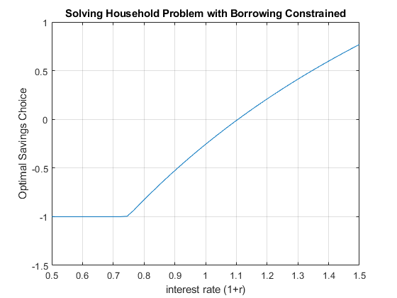

## Constrained Borrowing and Savings

```{r global_options, include = FALSE}
try(source('../.Rprofile'))
```

`r text_shared_preamble_one`
`r text_shared_preamble_two`
`r text_shared_preamble_thr`

We previously solved for the unconstrained household's savings and
borrowing problem: [unconstrained
problem](https://fanwangecon.github.io/Math4Econ/derivative_application/K_save_households.html).

### What is the constrained borrowing problem?

Imagine if endowment in the first period is $Z_1$, but now endowment in
the second period is $Z_2$.

-   **Utility**:
    $U(c_{today} ,c_{tomrrow} )=\log (c_{today} )+\beta \cdot \log (c_{tomorrow} )$

-   **Budget Today**: $c_{today} +b=Z_1$

-   **Budget Tomorrow**: $c_{tomorrow} =b\cdot (1+r)+Z_2$

Now $b$ can be positive or negative. Generally, if you go to a bank,
they let you save however much you want to deposit there, but you don't
usually get to borrow any amount you would like to borrow. Remember we
discussed before there is the natural borrowing constriant in this
model, which restricts borrowing what what we can repay in the worst
state of shock tomorrow (there is only one state in this case), so
borrowing is already naturally constrained by the household's
optimization problem.

If the borrowing constraint of the bank is lower than the natural
borrowing constraint, it is irrelevant, but if it is tighter than the
natural borrowing constraint, then it becomes relevant.

### Inequality Constraint

We can formulate the problem above as having 1 savings choice that is
constrained.

The objective function is :

-   generally: $\max_b f(b)$

-   specifically:
    $\max_b \log (Z_1 -b)+\beta \cdot \log (Z_2 +b\cdot (1+r))$

And the constraint is:

-   $\displaystyle b\ge \bar{b}$

$\bar{b}$ is the borrowing limit. Note that because $b$ is negative when
we are borrowing, so a higher upper bound on how much you can borrow is
represented by a more negative $\bar{b}$.

We can think of the inequality constraint more generally as a function:

-   $\displaystyle g(b)\le q$

Where $g$ is some function of $b$, and $q$ is just a number, note that
we want to write this as the function of the choice is less than or
equal to something. For our example here, you can think of function $g$
as: $g(b)=-b$ and $q=-\bar{b}$; or $g(b)=\bar{b} -b$, $q=0$. They of
course are the same:

-   $\displaystyle \bar{b} -b\le 0$

### Lagrangian with Inequality Constraint

When we write the lagrangian, we have to be careful about the signs,
writing the inequality constraint as we do above, we will do the
\"double negative\" as we did with equality constraint when we add in
the lagrange multiplier term, the lagrangian is:

-   $\displaystyle \mathcal{L}=\left\lbrace \log (Z_1 -b)+\beta \cdot \log (Z_2 +b\cdot (1+r))\right\rbrace -\lambda \cdot (\bar{b} -b-0)$

For inequality constraint, we follow SB and use $\lambda$ for the
lagrange multiplier.

### Derivative with Respect to $b$

The key thing to understand about inequality constraint is that the
first order condition that we had from the [unconstrained
problem](https://fanwangecon.github.io/Math4Econ/derivative_application/K_save_households.html)
no longer holds. Specifically, the uncontrained problem's derivative
with respect to $b$ set equal to $0$ would be:

-   $\displaystyle \frac{1}{Z_1 -b}=\beta \frac{1+r}{Z_2 +b(1+r)}$

Which means the Marginal Utility of Consumption today must be equal to
the Marginal Utility of Consumption tomorrow. The household will use
saving and borrowing as a mechanism to smooth their consumption given
their endowment in each period, the interest rate, and discount factor.
But now, with the inequlaity constraint, the derivative of the
lagrangian with respect to $b$ set equal to $0$ is:

-   $\displaystyle \frac{1}{Z_1 -b}=\beta \frac{1+r}{Z_2 +b(1+r)}+\lambda$

We gained an extra $\lambda$ term. Given that we can not adjust (borrow)
$b$ freely now, we might have too little consumption today, leading to
high marginal utility of consumption today, and too much consumption
tomorrow (due to higher endowment), leading to lower marginal utility of
consumption tomorrow. Without constraint, we would have chosen,
$b^{*,\textrm{unconstrained}}$: borrowing today to reduce marginal
utilty today and increase marginal utility tomorrow until consumption is
smoothed over the two periods. With constraint, we would chose,
$b^{*,\textrm{constrained}}$. If
$b^{*,\textrm{unconstrained}} \ge \bar{b}$, then the constraint does not
matter, and $\lambda =0$, if $b^{*,\textrm{unconstrained}} <\bar{b}$,
then the constraint does matter, and $\lambda >0$ in this case to
account for the marginal utility cost of the borrowing constraint.

### First Order Conditions with Inequality Constraint

Following our discussion above, what are the conditionals that the
optimal choice must satisfy in the prescence of inequality constraint?

The general problem here is:

-   $\displaystyle \max_b f(b)$

-   such that: $g(b)\le q$

With Lagrangian:

-   $\displaystyle \mathcal{L}=f(b)-\lambda \cdot (g(b)-g)$

Suppose that $f$ and $g$ functions are both continuously differentiable,
and $b^*$ maximizes $f$ given the constraint, then there exists
$\lambda^*$, such that:

1.  $\displaystyle \frac{\partial \mathcal{L}}{\partial b}(b^* ,\lambda^* )=0$

2.  $\displaystyle \lambda^* \cdot [g(b^* )-q]=0$

3.  $\displaystyle \lambda^* \ge 0$

4.  $\displaystyle g(b^* )\le q$

When the constraint does not bind, $\lambda^* =0$, satisfying the second
and third conditions, and the fourth condition is a strict inequality,
and the first condition's derivative is the same as the one in the
unconstrained problem. When the constraint does bind, the fourth
condition is an equality constraint, $\lambda$ is a postive number as in
the example above.

### Solving the Problem

How do we solve this problem? Given that the problem here only has one
choice, and given the concavity of log utility, and the linear
constraints, we can solve the unconstrained problem first, if the
optimal unconstrained choice is less than the constraint bound, then the
optimal choice with be the $b^* =\bar{b}$, if the optimal unconstrained
choice is greater than the constraint bound, then the
$b^* =b^{*,\textrm{unconstrained}}$.

Our brute force method also works well in this case, we simply limit the
grid of feasible $b$ choices to be within the constraint set, and find
the point along the grid where utility is the highest.

Matlab has a conveninent function that solves any constrained
maximization problem, ***fmincon***, we will use it here. First, let's
write our constraint like this:

-   we had: $\bar{b} -b\le 0$

-   this is also: $\left\lbrack \begin{array}{c}
    -1
    \end{array}\right\rbrack \cdot \left\lbrack \begin{array}{c}
    b
    \end{array}\right\rbrack \le \left\lbrack \begin{array}{c}
    -\bar{b} 
    \end{array}\right\rbrack$

-   we can think of this as: $A\cdot b\le q$. The $A$ matrix and $q$
    vector represent the set of linear constraints.

Define the parameters and the equations

    clear all
    % Parameters
    beta_num = 0.95;
    z1_num = 10;
    z2_num = 20;
    r_num = 1.05;
    b_bar_num = -1; % borrow up to 1 dollar 

    % Write down the objective function, we will define it as a function handle, negative utility for minimization
    syms beta z1 z2 r
    UNeg = @(b) -1*(log(z1 - b) + beta*log(z2 + b*(1+r)))

    UNeg = 
        @(b)-1*(log(z1-b)+beta*log(z2+b*(1+r)))

    % Constraint
    A = [-1];
    q = -b_bar_num;

Now call fminunc to solve

    b0 = [0] % starting value to search for optimal choice

    b0 = 0

    UNeg_num = matlabFunction(subs(UNeg, {beta, z1, z2, r}, {beta_num, z1_num, z2_num, r_num}));
    [bOpti,UatBOpti] = fmincon(UNeg_num, b0, A, q);

    Local minimum found that satisfies the constraints.

    Optimization completed because the objective function is non-decreasing in 
    feasible directions, to within the value of the optimality tolerance,
    and constraints are satisfied to within the value of the constraint tolerance.

    <stopping criteria details>

    bOpti

    bOpti = -0.1313

    UatBOpti

    UatBOpti = -5.1487

### Effects of $Z_2$ on optimal choices

How does optimal choice change if the household has more endowment
tomorrow?

    % Create a vector of Z2, so Z2 fector starts at the same value as Z1*0.5 going up to 4 times Z1
    Z2_vec = linspace(z1_num*0.5, z1_num*4, 20)

    Z2_vec = 1x20    
        5.0000    6.8421    8.6842   10.5263   12.3684   14.2105   16.0526   17.8947   19.7368   21.5789   23.4211   25.2632   27.1053   28.9474   30.7895   32.6316   34.4737   36.3158   38.1579   40.0000

    % A vector to store optimal choices
    bOpti_vec = zeros(size(Z2_vec));
    % Solving for optimal choices as we change Z2
    for i=1:1:length(Z2_vec)
        UNeg_num = matlabFunction(subs(UNeg, {beta, z1, z2, r}, {beta_num, z1_num, Z2_vec(i), r_num}));
        options = optimoptions('FMINCON','Display','off');
        [bOpti,UatBOpti] = fmincon(UNeg_num, b0, A, q, [], [], [], [], [], options);
        bOpti_vec(i) = bOpti;
    end

    % Plot Results
    figure()
    plot(Z2_vec, bOpti_vec)
    grid on;
    ylim([-2 4]);
    title('Solving Household Problem with Borrowing Constrained')
    ylabel('Optimal Savings Choice')
    xlabel('Endowment next Period')

{width=500px}

### Effects of $r$ on optimal choices

How does optimal choice change if the household has more endowment
tomorrow?

    % Vector of interest rates
    r_vec = linspace(0.5, 1.50, 50);
    % A vector to store optimal choices
    bOpti_vec = zeros(size(r_vec));
    % Solving for optimal choices as we change Z2
    for i=1:1:length(r_vec)
        UNeg_num = matlabFunction(subs(UNeg, {beta, z1, z2, r}, {beta_num, z1_num, z2_num, r_vec(i)}));
        options = optimoptions('FMINCON','Display','off');
        [bOpti,UatBOpti] = fmincon(UNeg_num, b0, A, q, [], [], [], [], [], options);
        bOpti_vec(i) = bOpti;
    end

    % Plot Results
    figure()
    plot(r_vec, bOpti_vec)
    ylim([-1.5 1]);
    grid on;
    title('Solving Household Problem with Borrowing Constrained')
    ylabel('Optimal Savings Choice')
    xlabel('interest rate (1+r)')

{width=500px}
